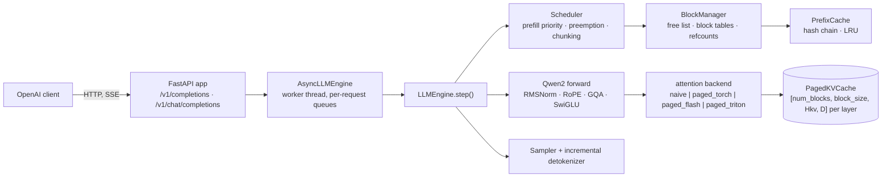
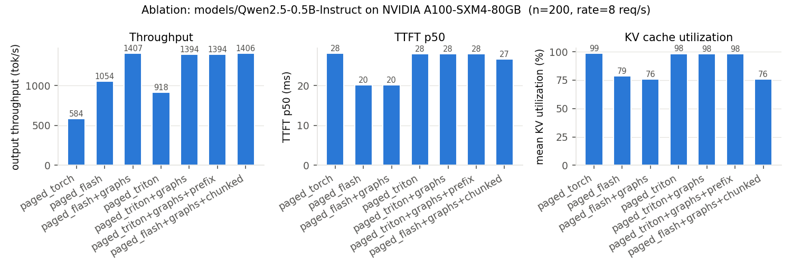
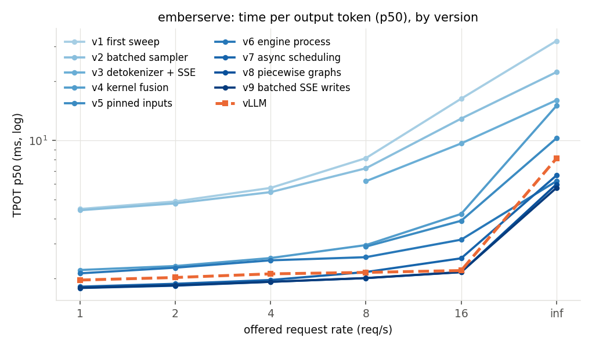
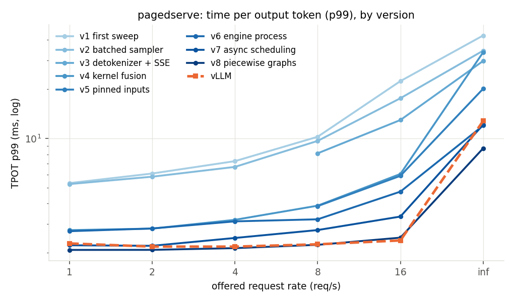
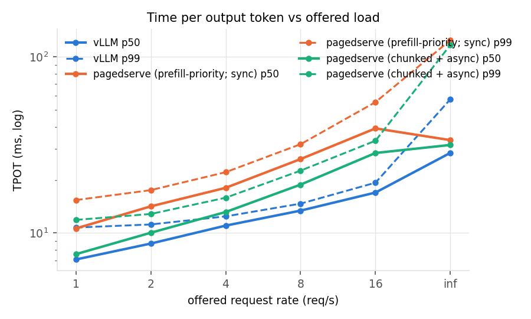
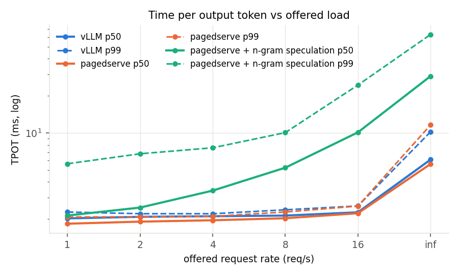
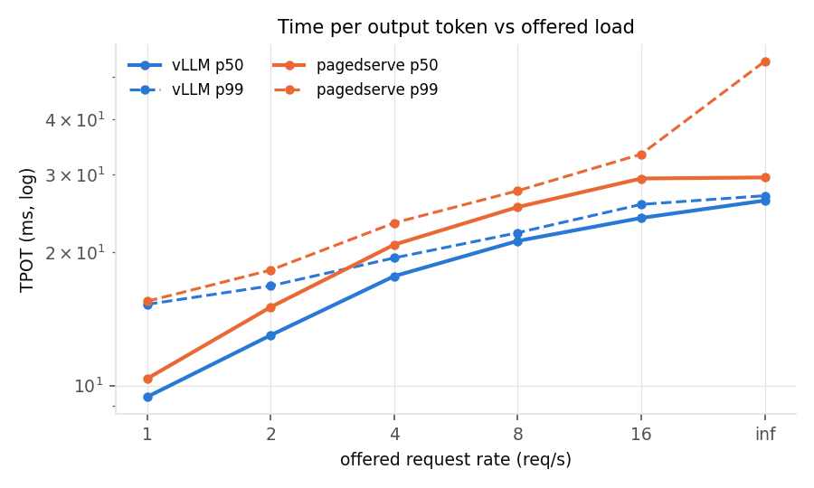
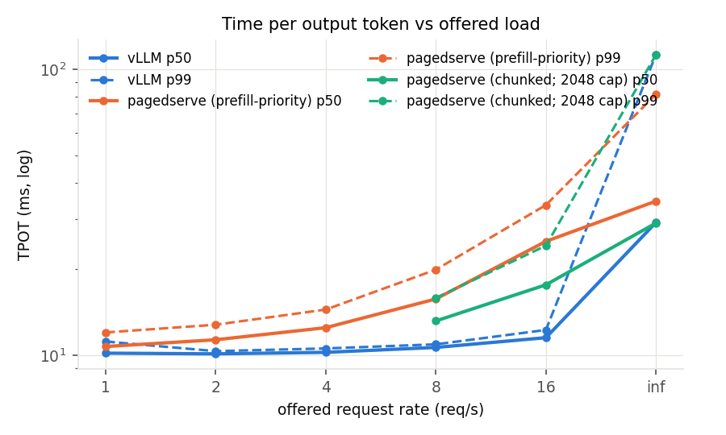

# pagedserve

[](https://github.com/ashwinsreedhar28/pagedserve/actions/workflows/ci.yml)

A from-scratch LLM inference engine in PyTorch, built to understand what vLLM does and
to measure how far a one-person implementation lands from it on the same GPU and model.

* Qwen2.5-0.5B-Instruct forward pass written here (RMSNorm, RoPE, GQA, SwiGLU, safetensors
  loader); `transformers` is used only for the tokenizer and as the golden reference.
* Continuous batching with a prefill-priority, iteration-level scheduler; block-gated
  admission; recompute preemption; optional chunked prefill.
* Paged KV cache with block tables, refcounted block sharing, and hash-chained automatic
  prefix caching with LRU eviction.
* Four interchangeable attention backends behind one contract: `naive`, `paged_torch`
  (gather, the reference), `paged_flash` (flash-attn paged decode + varlen prefill), and
  `paged_triton` (a hand-written Triton PagedAttention decode kernel with GQA head packing,
  online softmax and split-K).
* CUDA-graph decode at batch buckets.
* OpenAI-compatible server (`/v1/completions`, `/v1/chat/completions`, SSE streaming,
  disconnect cancellation, `/metrics`).
* A benchmark harness (ShareGPT-like traces, Poisson arrivals, in-process ablation, HTTP
  load generator) and a vLLM baseline runner, so every claim below is one command to re-run.

Correctness gate: greedy output is token-for-token identical to Hugging Face on 7 prompts x
64 tokens, and prompt logits match within 1e-3, on every backend (fp32 exact; fp16 held to a
self-calibrated tie-break rule described below). 176 CPU tests on a 2-layer random-weight model (no download, no GPU) and 31 GPU tests.

## Headline numbers

Qwen2.5-0.5B-Instruct fp16, 200-request ShareGPT-like trace (prompt median 208 tokens,
output median 131), seed 0, same trace for every row. Raw files in `results/`.

| | RTX 4090 | A100 SXM 80 GB |
|---|---:|---:|
| naive per-sequence cache, 8 req/s | 343 tok/s | |
| paged_flash + CUDA graphs, 8 req/s | 1,441 tok/s, TPOT p50 3.8 ms | 1,381 tok/s, TPOT p50 2.0 ms (HTTP) |
| paged_flash + CUDA graphs, all 200 at t=0 | 5,459 tok/s (in-process) | **14,904 tok/s** (HTTP, engine process, async scheduling, chunked prefill on piecewise graphs) |
| vLLM, same trace, same GPU, 8 req/s | | 1,377 tok/s, TPOT p50 2.1 ms |
| vLLM, all 200 at t=0 | | 16,269 tok/s |
| Triton decode kernel vs flash-attn, B=128 / ctx 2048 | 4.2x slower (first version) | **1.16x** slower (835 vs 972 GB/s) |
| KV-cache slot utilization, block 16 vs 256 | | **98% vs 76%** |

Against vLLM on the A100 with Qwen2.5-0.5B: throughput parity to 16 req/s (100%), lower
latency than vLLM at every offered rate (TPOT 1.8 vs 2.0 ms and TTFT 9.4 vs 12.9 ms at
1 req/s; TPOT 6.0 vs 8.1 ms at saturation), 92% of its saturation throughput, up from 23% at
the first measurement the same night. At 7B (Qwen2.5-7B-Instruct) both engines sit on the
weight-read floor and pagedserve reaches 99% of vLLM at saturation with chunked prefill and
async scheduling; DeepSeek-R1-Distill-Llama-8B (llama path) is also at 99%, and Moonlight-16B-A3B (DeepSeek-V3's
latent attention + MoE) reaches 84% on the synthetic trace and 89% on real text with a
batch-1 step of 6.2 ms against vLLM's 7.1 ms TPOT. The [gap analysis](#the-gap-against-vllm) has the per-phase profile and the eight
fixes it drove, in order; [Models](#models) has the per-model table.

## How it works



### The step loop

`LLMEngine.step()` is `schedule -> build inputs -> forward -> sample -> postprocess`. Each
step is either a **prefill batch** (new or re-admitted requests, packed with no padding,
bounded by `max_num_batched_tokens`) or a **decode batch** (one token for every running
request). Tokens are packed `[num_tokens, heads, head_dim]` with `cu_seqlens`, never padded.

### Scheduler

Prefill has priority: whenever the waiting queue is non-empty and the request's blocks can be
allocated, the step is a prefill; otherwise it is a decode over everything running. Admission
is block-gated FIFO, so a request never starts unless its prompt fits. When decode runs out of
blocks, the youngest running request is preempted by recompute (blocks freed,
`num_computed_tokens` reset, back to the front of the queue). Outputs are identical with or
without preemption; that is a test.

With `--enable-chunked-prefill` (Sarathi-Serve / vLLM style; the default on CUDA) a step
is instead **mixed**: one
decode token for every running request whose prefill is done, plus as many prompt tokens as
fit in the remaining `max_num_batched_tokens` (mid-prefill requests first, then new ones). A
long prompt is split across steps, so it no longer stalls every decoder's TPOT for one long
step, and prompts longer than the budget are accepted. A partial chunk writes K/V and emits
nothing; the token is sampled only on the step that completes the prompt
(`SchedulerOutput.prefill_complete`). Chunked outputs equal unchunked outputs; also a test.

With `--async-scheduling` (vLLM v1's trick; the default on CUDA) the engine launches step
N+1 before it has read step N's sampled tokens back from the GPU: the scheduler assumes every sampled request
advanced by one token, decode rows whose token is still on the device take it from the
previous step's sampled tensor with a device-side gather, and the tokens come back through
a pinned buffer whose copy was enqueued before step N+1's kernels, so waiting for them never
waits for step N+1. The CPU work of a step (schedule, pack inputs, launch, detokenize)
overlaps the GPU work of the previous one and the device never idles between steps. A
request ending on EOS computes one extra token that is discarded; length limits are
anticipated (`Scheduler._finishes_on_resolve`) so they waste nothing. Outputs of a step are
returned by the next `step()` call; tokens are identical to the synchronous engine's,
including under preemption, chunked prefill, prefix caching, seeded sampling and aborts.

### Speculative decoding

`--speculative-ngram 3 --num-speculative-tokens 5` turns on prompt-lookup speculation
(`spec.py`): for every greedy request the engine looks up the last three tokens earlier in
the sequence and guesses that what followed them then follows now (code, quoted text,
names, lists). The guesses ride in the request's next decode step as extra query rows
over the cached context, exactly like a chunked-prefill chunk; the model's own greedy
choice at every position is compared with the guess at that position, the longest
agreeing prefix is kept together with the model's token after it, and the rejected
positions' K/V slots are given back (`BlockManager.truncate`). The output is bit-identical
to plain greedy decoding: every accepted token was checked against the same logits it
would have been sampled from. A step that carries drafts routes through the mixed
attention path (piecewise graphs where they are on), a step without any keeps the full
decode graph. Sampled requests are never drafted, and the mode turns async scheduling off
(the proposer needs the last token on the host). `/metrics` reports `spec_drafted_total`
and `spec_accepted_total`; on the synthetic random-id trace the acceptance rate is ~0, which
is why the real-text traces exist. Measured on ShareGPT text it is a net loss at every
rate, at 0.5B and at 7B (see [Real text](#real-text-sharegpt-conversations-results_textjson)):
3-gram lookup accepts 16% of its drafts on chat text, the verification step runs through
the mixed-step path (eager at 7B) and async is off, and those cost more than 0.19 extra
tokens per step return. The exact verification is the reusable part; what it needs is a
fixed-`k` draft step captured as a graph bucket, async kept on, and a better proposer.

### Paged KV cache

Each layer's cache is one tensor `[num_blocks, block_size, Hkv, D]` for K and one for V.
A sequence owns a **block table** (list of physical block ids); token position `p` lives at
slot `table[p // block_size] * block_size + p % block_size`. The `BlockManager` keeps the
free list, allocates a block when the previous one fills, refcounts blocks so prefixes can be
shared, and reports utilization (`slots in use / slots allocated`). Memory waste is bounded by
one partial block per sequence, which is why block size is an ablation knob and not a detail.

For Qwen2.5-0.5B in fp16 one token of K+V across 24 layers is `2 * 24 * 2 * 64 * 2 B = 12 KB`;
20 GB of cache holds ~1.6 M tokens.

### Prefix caching

Every full block is hashed by the chain `(parent_hash, token_ids_in_block)`. A new request
looks up its prompt's leading full blocks, skips those tokens in prefill (attention still sees
them: `context_lens` counts cached positions and the queries are the last `query_len` of the
context), and shares the physical blocks by refcount. Unreferenced cached blocks sit in an
LRU and are evicted when the free list runs dry. A fully cached prompt still computes at least
its last token so there is a logit to sample from.

### Attention backends

All four implement one contract (`attn/base.py`): given packed Q/K/V for this step, write K/V
into the cache at the step's slots, then attend causally where `context_lens[i]` is the KV
length *after* the write.

| backend | decode | prefill | block size | notes |
|---|---|---|---|---|
| `naive` | per-sequence `torch.cat` cache | same | n/a | what "no KV cache management" looks like |
| `paged_torch` | `index_select` blocks into a padded `[B, max_ctx, Hkv, D]`, masked softmax | same | any | the reference for every other backend's tests |
| `paged_flash` | `flash_attn_with_kvcache(block_table=...)` | `flash_attn_varlen_func` | multiple of 256 | upstream flash-attn hard-checks `page_block_size % 256` |
| `paged_triton` | hand-written Triton kernel, grid `(B, Hkv, splits)` | `flash_attn_varlen_func` on the step's packed k/v; chunk rows with cached context are gathered out of the paged cache into a packed buffer first, decode rows of the same step still run the Triton kernel | multiple of 16 | one program owns one sequence, one KV head and all its GQA query heads; online softmax; split-K past 1k keys; `tl.dot` on tensor cores |
| `mla_torch` / `mla_triton` | absorbed latent attention: fp32 reference / Triton kernel over the `[c \| k_pe]` rows | flash varlen in the non-absorbed form (per-head k/v materialized from the latent); chunk rows gather + varlen like `paged_triton` | multiple of 16 | DeepSeek-V2/V3 and Moonlight; see below |

`paged_triton` exists because flash-attn's block-256 constraint is not free: at block 256 a
64-token shared prefix never fills a block and gets zero cache hits, and KV utilization drops
to 76%. The Triton kernel makes block 16 usable on the GPU.

### Latent attention and MoE

DeepSeek-V2/V3 (and Moonshot's Moonlight, which uses that architecture) replace per-head K/V
with **multi-head latent attention**: each token is projected to a 512-dim compressed latent
`c` plus a 64-dim rope key `k_pe` shared by all heads, and per-head keys and values are
`W_UK[h] c` and `W_UV[h] c`, never stored. The cache row is `[c | k_pe]`, 576 values per
token per layer (`kv/cache.py: PagedLatentCache`): Moonlight caches 31 KB per token where
its GQA equivalent would need ~220 KB. pagedserve runs the *absorbed* form
(`attn/mla_torch.py`): `W_UK` is folded into the query (`q_c = W_UK[h]^T q_nope`, a
512-dim query per head) so scores are dot products against the raw cache rows, and `W_UV`
is applied after the softmax. Attention becomes MQA over the latent, 16 query heads
against one 576-wide key row, which is exactly what the Triton decode kernel is shaped for
and what flash-attn cannot do (its head dim tops out at 256). DeepSeek's RoPE pairs
dimensions (2i, 2i+1) rather than (i, i+D/2); the model permutes q_pe/k_pe once so the
same rotate-half kernel applies.

The MLP after the first layer is a **mixture of experts** (`model/moe.py`): a router scores
64 experts with a sigmoid, adds a per-expert bias that steers *which* experts are chosen
but not their weights (DeepSeek-V3's aux-loss-free balancing), keeps the top-6, normalizes
those six sigmoid scores and scales them by 2.446, and adds 2 shared experts every token
uses. Experts are stored stacked (`[E, 2I, H]` and `[E, H, I]`). The reference forward
loops over the experts that received tokens (gather, one fused SwiGLU, `index_add_` back);
on CUDA the layer is four launches (`model/moe_triton.py`): a Triton **router** kernel
(sigmoid, bias, top-k, gather, normalize, scale), a Triton **alignment** kernel that sorts
the `N x k` (token, expert) assignments into 16-row blocks that each belong to one expert
without ever asking the host how many tokens an expert got (program per expert: count,
prefix-sum, rank, scatter), and a **grouped GEMM** kernel run twice (gate/up over all
experts at once, then down with the routing weight folded in) whose program `(block,
n-tile)` multiplies its block's rows by *its* expert's weight tile. The loop version was
correct and 15x too slow on Moonlight: a host sync (`bincount` sizing its output) plus ~6
launches per active expert per layer made a 63.6 ms batch-1 step against a ~4 ms
weight-read floor; the fused path is 9.2 ms and, because nothing in it depends on tensor
values on the host, it captures into CUDA graphs along with the Triton MLA decode kernel.
The routing is tested against a line-by-line transcription of HF's `modeling_deepseek_v3`,
the kernels against the loop, the attention against a non-absorbed HF-style reference, and
the real model matches HF greedy on Moonlight through both the torch and the Triton paths.

### CUDA graphs

`--enable-cuda-graphs` captures the decode forward once per batch bucket (1, 2, 4, ..., 256)
into static input buffers; a step replays the bucket at or above its batch size with padded
rows pointed at one reserved scratch block. Graphs are worth more than any kernel at this
model size: the kernels themselves take a couple of milliseconds across 24 layers and the rest was launch overhead,
so TPOT fell from 9.1 to 3.8 ms on the 4090.

Prefill and mixed (chunked-prefill) steps have variable shapes, so they ran eagerly, and at
0.5B that made chunked prefill cost 11% at saturation. `--piecewise-cuda-graphs`
(`attn/piecewise_graphs.py`, vLLM v1's approach) captures everything *except* attention:
each decoder layer is three pieces, `pre` (input norm + residual add, projections, RoPE),
`attend` (the kernel, eager on the real rows with the step's real metadata) and `post`
(output projection, post norm, MLP); `pre` and `post` are row-wise, so they replay from
per-layer graphs on rows padded up to a token bucket, and padded rows never reach the KV
cache. A mixed step is then two replays plus the attention launches per layer. On the A100
it turned chunked prefill at 0.5B from an 11% loss into a 4% gain (14,904 tok/s) and halved
TTFT at low load (9.4 ms vs 19.8 eager, vLLM 12.9). At 7B it costs 1%: the padded chunk is
real compute there. So it is the default for checkpoints under 4 GB, and chunked prefill is
the default on CUDA wherever the mixed step is not eager (everywhere but a small model
served without graphs).

### Weight-only int8

`--quantization int8` (`model/quant.py`) halves the bytes of every projection after the
checkpoint is loaded: each 2-D `nn.Linear` of the decoder and the `lm_head` is replaced,
one at a time, by an `Int8Linear` holding `round(W / s)` in int8 with one fp32 scale per
output row (`s[n] = max_k |W[n,k]| / 127`); the fp16 copy is freed before the next layer
is converted, so a 7B checkpoint peaks at its fp16 size and settles at ~8 GB. Activations
stay fp16/bf16 and the arithmetic does not change: a Triton GEMM streams the int8 weight
tiles, converts them to the activation dtype in registers, multiplies on the tensor cores
and applies the row scale to the fp32 accumulator (`(x @ q^T) * s`, an exact
rearrangement of `x @ (q * s)^T`), with the bias folded into the same epilogue. Tiles
are chosen from the row count (16x64 at decode, 128x128 for prefill). It is a quality
trade, not an exact transform, which is why it is a flag and not a default:
`scripts/check_golden.py --quantization int8` reports how many greedy tokens move against
the fp16 golden run. Embeddings, MLA's `kv_b_proj` (read directly by the attention kernel)
and the MoE expert stacks (3-D weights, their own grouped GEMM) stay in fp16/bf16. The
point at 7B is the batch-1 decode step, which is the weight read (15 GB at ~1.5 TB/s,
~10 ms); halving the read halves that floor, and at larger batches, where the step turns
compute-bound, the gain shrinks to nothing. Measured on the 7B (A100, `paged_flash` +
graphs; `results/profile_7b_fp16.json`, `profile_7b_int8_v2.json`,
`pagedserve_7b_flash_int8_v2.json`):

| decode step (ms) | batch 1 | batch 8 | batch 32 | batch 128 |
|---|---:|---:|---:|---:|
| fp16 (cuBLAS) | 10.09 | 10.31 | 10.81 | 15.13 |
| int8, first kernel | 7.78 | 8.59 | 19.43 | 29.18 |
| int8, v2 (autotuned tiles + split-K) | **6.37** | **6.88** | **9.57** | 19.81 |

| req/s offered | vLLM TPOT p50 | pagedserve fp16 | pagedserve int8 |
|---|---:|---:|---:|
| 1 | 10.2 ms | 10.2 ms | **6.6 ms** |
| 4 | 10.2 | 11.1 | **7.9** |
| 8 | 10.6 | 12.6 | 12.2 |
| 16 | 11.5 | 16.5 | 26.3 |
| all at t=0, tok/s | 3,188 | 3,166 | 2,548 |

The first kernel halved the bytes and cut the batch-1 step 23%, not 50%: it launched
56–72 programs for the A100's 108 SMs (`N / BN` tiles of a one-row output) and read at
0.96 TB/s, and above batch 32 its one fixed tile shape plus a register transpose of the
weight tile left it 2x behind cuBLAS. v2 reads the weight tile in the layout `tl.dot`
wants, autotunes the tile shape per (M bucket, N, K) at load time, and cuts the K range
into pieces when the output has too few tiles (split-K: fp32 partials and a reduce kernel
carrying the scale and bias): 6.37 ms at batch 1 (−37%), ahead of fp16 to batch 32, and
still 31% behind cuBLAS at batch 128, which is the compute-bound end where a hand-written
Triton GEMM has to beat a tuned library. Over HTTP that is TPOT below vLLM's by a third
up to 4 req/s and a loss from 8 req/s up, where chunked-prefill steps run the same kernel
at M = 2048. Quality: the golden check reports 2 of 7 prompts exact for 64 tokens and the
other 5 diverging at a near-tie (top-2 margins 0.05–0.39 logits), the expected cost of
per-channel rounding. So `--quantization int8` is the right flag for a latency-bound
deployment at small batch, and the wrong one at saturation until the large-M path is
either a better kernel or a dequantize-then-cuBLAS step. `PAGEDSERVE_INT8_KERNEL=0`
routes through the torch reference, `PAGEDSERVE_INT8_AUTOTUNE=0` and
`PAGEDSERVE_INT8_SPLITK=0` pin the kernel for A/B.

### Tensor parallelism

`--tensor-parallel-size 2` (`dist.py`) splits the dense model across two GPUs the Megatron
way: each decoder layer is cut along the dimension that needs no communication inside the
block, so a rank owns `num_heads / 2` query heads and `num_kv_heads / 2` KV heads (the
q/k/v rows of `qkv_proj` are column-parallel, `o_proj` row-parallel) and half of the MLP's
intermediate width (`gate_up_proj` column-parallel, `down_proj` row-parallel). The two
row-parallel projections each end in one all-reduce of `[num_tokens, hidden]`, and that is
the whole communication of a layer; embeddings and norms are replicated, the `lm_head` is
vocabulary-parallel with one all-gather of the logits at the end. The paged KV cache is
split the same way (a rank caches its own KV heads), so a 7B model that fills one A100
has 7.5 GB of weights and twice the KV blocks per GPU, and the batch-1 decode step, which
is the weight read, streams half the bytes.

The process model is vLLM's driver + workers: rank 0 is the engine (scheduler, block
manager, sampler; the API's engine-core process), the other ranks are
`python -m pagedserve.dist` subprocesses running `LLMEngine.worker_loop` with no scheduler of
their own. Per step the driver broadcasts the step plan (the host-side lists
`_plan_inputs` computes: tokens, positions, slots, block tables) over a gloo group, every
rank materializes the same device tensors from it, and the driver's `input_ids` (which
under async scheduling hold tokens gathered on the device from the previous step's
logits, so no other rank could build them) go out over NCCL; then every rank runs the
identical forward and only the driver samples. The host-side broadcast never touches the
device, so async scheduling keeps its overlap, and the collectives are captured into the
CUDA graphs with the rest of the forward. Checkpoints are sliced as they are read
(`dist.shard_tensor`), one rank's slice per process, and a worker that loses its driver
exits on its own. Exactness: the two-process CPU tests (`tests/test_tensor_parallel.py`)
compare a TP=2 gloo engine token-for-token with the single-process engine through the
plain, async, chunked-prefill and speculative paths and through the engine-core
process. Latent attention and MoE are single-GPU for now. Numbers need a 2-GPU pod
(`README_GPU.md`, "Tensor parallelism").

## Correctness

```bash
make golden        # dump HF greedy + logits -> golden/, then check every CPU backend
python scripts/check_golden.py --device cuda --dtype float16 --backends paged_flash,paged_triton --block-size 256
```

fp32 runs must match the fp32 Hugging Face reference exactly: logits within 1e-3 and tokens
token-for-token, on all 7 prompts decoded together in one continuous batch (so batching,
paging and prefix sharing are all under test at once). Half-precision runs are compared to
the same fp32 reference, so the gate is self-calibrated: the logits bar is 1.0 and a token
flip counts as a numeric tie-break, not a failure, only when the top-2 logit gap at that
position is below 2x the logits error measured on prompt 0, i.e. the two candidates were
closer than the run's own precision noise. Two gotchas this gate caught: Qwen2.5's
`generation_config.json` sets `repetition_penalty=1.05`, so `model.generate()` is not greedy
unless every knob is overridden; and `apply_chat_template` in transformers 5 returns an
encoding, not a string.

```bash
make test                          # 176 CPU tests, 2-layer random model, no download
python -m pytest -m gpu -n 4 -v    # 31 GPU tests: flash/triton kernels vs paged_torch, engine parity, graph capture
```

## Results

All runs: Qwen2.5-0.5B-Instruct fp16, 200 requests, seed 0, `max_model_len 4096`. TTFT is
time to first token, TPOT is time per output token after the first, both per request.

### RTX 4090 ablation (`results/ablation*.json`, block size 256, torch 2.8.0+cu128)

**Open-loop, 8 req/s** (arrivals span 24.3 s; a config that keeps up finishes in ~25 s):

| config | tok/s | run | TTFT p50/p99 ms | TPOT p50/p99 ms | e2e p50 |
|---|---:|---:|---:|---:|---:|
| naive (per-seq `torch.cat`) | 343 | ~108 s | – | – | – |
| static batching | 595 | ~62 s | – | – | – |
| paged_torch | 700 | 52.8 s | 12.2 / 27.9 | 86.2 / 141 | 12.7 s |
| paged_flash | 1,329 | 27.8 s | 8.7 / 10.0 | 9.1 / 9.9 | 1.21 s |
| paged_flash + CUDA graphs | **1,441** | 25.6 s | 8.7 / 10.6 | **3.8 / 4.8** | 0.52 s |

**Saturation, all 200 at t=0:** paged_torch 738 -> paged_flash 3,043 -> +graphs **5,459 tok/s**
(TTFT p50 279 ms, TPOT p50 12.4 ms).

**Prefix caching, 8 req/s:** a 64-token shared prefix did nothing at block 256 (no full block
is ever shared). A 512-token prefix moved TTFT p99 from 10.3 to 9.5 ms and nothing else,
because prefill on a 0.5B model is ~8 ms to begin with.

### A100 SXM 80 GB, decode-attention kernel (`results/kernels_a100_*.json`)

Decode attention only, H=14, Hkv=2, D=64, fp16, median of 20 calls. Ratio = Triton kernel
time / flash-attn time (1.0 = parity); the `tl.dot` tensor-core variant is the default.

| Triton block | ctx | B=1 | B=8 | B=32 | B=128 |
|---|---|---|---|---|---|
| 256 | 128 | 2.04x | 1.98x | 1.98x | 1.92x |
| 256 | 512 | 2.40x | 2.31x | 2.25x | 1.73x |
| 256 | 2048 | 2.26x | 2.25x | 1.93x | **1.16x** (835 vs 972 GB/s) |
| 16 | 2048 | 2.26x | 2.24x | 1.92x | 1.54x |

The first version of the kernel (broadcast-multiply, CUDA cores) was 3.3x–10.8x behind on the
same GPU and 4.2x behind on the 4090. Moving QK^T and PV onto tensor cores (`tl.dot`, query
heads padded 7 -> 16) closed the gap at large batch; what remains is a flat ~0.04 ms per call
that does not scale with work, so short contexts and small batches stay ~2x behind.
`paged_torch` on the same shape: 7.41 ms, 18 GB/s.

### A100 ablation (`results/ablation_a100.json`, 8 req/s, 64-token shared prefix, before the five fixes)

Every backend at its own minimum block size (`paged_flash` 256, the rest 16):

| config | block | tok/s | TTFT p50 | KV slot utilization |
|---|---:|---:|---:|---:|
| paged_torch | 16 | 584 | 28 ms | 99% |
| paged_flash | 256 | 1,054 | 20 | 79% |
| paged_flash + graphs | 256 | 1,407 | 20 | 76% |
| paged_triton | 16 | 918 | 28 | 98% |
| paged_triton + graphs | 16 | 1,394 | 28 | 98% |
| paged_triton + graphs + prefix | 16 | 1,394 | 28 | 98% |
| paged_flash + graphs + chunked | 256 | 1,406 | 27 | 76% |



The Triton path at block 16 keeps up with flash at block 256 (1,394 vs 1,407 tok/s) with
22 points more slot utilization; its +8 ms TTFT is the gather-path prefill fallback, not
the kernel. Chunked prefill changes nothing at 0.5B, where a prefill is ~8 ms; at 7B it is the difference between 24.8 and 17.5 ms TPOT (see [Models](#models)).

### A100, pagedserve over HTTP vs vLLM (`results/vllm.json`, `results/pagedserve_*.json`)

Same load generator, same trace, same GPU, both servers fp16 with `max_model_len 4096`.
pagedserve with its CUDA defaults: `paged_flash`, block 256, CUDA graphs (full-step for
decode, piecewise for prefill and mixed steps), chunked prefill, engine in its own process,
async scheduling (`results/pagedserve_flash_v8.json`). vLLM from its own venv, defaults.

| req/s offered | vLLM tok/s | pagedserve tok/s | vLLM TTFT p50 | pagedserve TTFT p50 | vLLM TPOT p50/p99 | pagedserve TPOT p50/p99 |
|---:|---:|---:|---:|---:|---:|---:|
| 1 | 177 | 177 | 12.9 ms | **9.4** ms | 2.0 / 2.3 | **1.8** / 2.1 |
| 2 | 354 | 354 | 11.9 | **10.0** | 2.0 / 2.2 | **1.8** / 2.1 |
| 4 | 701 | 702 | 11.6 | **11.0** | 2.1 / 2.2 | **1.9** / 2.1 |
| 8 | 1,377 | 1,381 | 12.0 | **11.5** | 2.1 / 2.3 | **2.0** / 2.2 |
| 16 | 2,659 | 2,673 | 12.0 | 12.4 | 2.2 / 2.4 | **2.1** / 2.5 |
| all at t=0 | **16,269** | **14,904** | 421 | 543 | 8.1 / 12.8 | **6.0** / **8.7** |

Every version of the engine on the same sweep, one line per fix (the fix table is in the
[gap analysis](#the-gap-against-vllm)); v3, v5 and v6's low rates were not re-run on
their commits, so those lines start at 8 req/s. Figures:
`python -m pagedserve.bench.plot --progression results/vllm.json results/pagedserve_flash*.json ...`
(`results/plots/progression/`).





(`results/pagedserve_flash_final.json` is the v8 run; regenerate the figures with
`python -m pagedserve.bench.plot results/vllm.json results/pagedserve_flash.json results/pagedserve_flash_final.json --labels "vLLM,pagedserve (first run),pagedserve (after 8 fixes)" --ablation results/ablation_a100.json`.)

Rates 1–8 are latency comparisons (throughput equals offered load for both); 16 and the
saturation row compare capacity. The `paged_triton` server at block 16 matched these to
8 req/s but paid +8 ms TTFT and 1.7 s TTFT at saturation
(`results/pagedserve_triton.json`) because its fresh-prompt prefill went through the
gather path at the time; prefill now runs flash varlen at any block size.

### The gap against vLLM

`scripts/profile_step.py` times one decode step per phase at fixed batch sizes, with a
device sync inside `forward` so GPU time lands there (A100, `paged_flash` + graphs, ms per
step; `results/profile_flash_*.json`):

| batch | version | schedule | build_inputs | forward | sample | postprocess | total |
|---:|---|---:|---:|---:|---:|---:|---:|
| 1 | before | 0.01 | 0.15 | **3.93** | 0.08 | 0.03 | 4.22 |
| 1 | after fusion | 0.01 | 0.15 | **1.93** | 0.08 | 0.02 | 2.22 |
| 1 | final | 0.01 | 0.09 | 1.89 | 0.08 | 0.03 | **2.12** |
| 200 | before | 0.17 | 2.00 | 6.17 | **10.79** | 2.85 | 22.02 |
| 200 | batched sampler | 0.17 | 2.01 | 6.18 | 0.31 | 2.86 | 11.58 |
| 200 | after fusion | 0.17 | 1.97 | 3.82 | 0.31 | 2.11 | 8.44 |
| 200 | final | 0.17 | 0.54 | 3.78 | 0.31 | 1.22 | **6.07** |

The same night, in order, each fix chosen from the profile and re-measured over HTTP:

| commit | fix | saturation tok/s | TPOT p50 @16 req/s |
|---|---|---:|---:|
| `1e65f8b` | first measurement | 3,717 | 16.3 ms |
| `0987fda` | **one CUDA sync per sequence per step**: the sampler looped over rows and called `.item()` on each (10.8 of 22 ms at batch 200). Batched argmax and batched temperature / top-k / top-p with per-row parameters, one `.tolist()` per step | 4,739 | 12.9 |
| `404bcd2` | **per-token CPU work that scaled with output length**: the detokenizer re-decoded a request's entire output every step, and the SSE loop polled `request.is_disconnected()` per token per stream. Sliding-window incremental detokenization (vLLM/TGI's two-offset scheme); sse-starlette already cancels on disconnect | 6,417 | 9.6 |
| `d82393e` | **a 3.9 ms forward at batch 1 inside a CUDA graph**: graphs remove launch overhead, but every kernel still costs 3–4 us of GPU time and the model ran ~42 per layer (unfused RMSNorm is 8 on its own). Fused `qkv_proj` / `gate_up_proj` weights, decoder in (hidden, residual) form, Triton RMSNorm+residual, RoPE and SiLU-mul: ~13 kernels per layer | 8,356 | 4.2 |
| `3805000` | **per-step host->device traffic and per-request decode calls**: six small `torch.tensor(..., device=cuda)` copies plus a per-row block-table build became two pinned copies; two `tokenizer.decode` calls per request became two Rust `decode_batch` calls per step | 10,584 | 3.9 |
| `94bdca3` | **the server and the engine shared one GIL**: at 200 streams the in-process step was 6.1 ms but 10.2 ms seen through the server, because SSE delivery and the step loop serialized on the interpreter lock. The engine core now runs in its own process (`--engine-process`, default on CUDA): token ids cross a pipe, the API process keeps the tokenizer, batched detokenization and stop strings, and the two overlap | 13,945 | 3.1 |
| `02d44f5` | **the GPU idled while Python built the next step**: the remaining per-sequence CPU in the core (0.5 ms of input building and 1.2 ms of postprocessing at batch 200) sat on the critical path. Async scheduling (vLLM v1's trick, `--async-scheduling`, default on CUDA): step N+1 is scheduled, packed and launched before step N's tokens are read back; decode rows gather their token from the previous step's sampled tensor on the device; the read-back goes through a pinned buffer whose copy was enqueued before the next launch; length limits are anticipated so no token is wasted | 14,394 | 2.5 |
| `1942991` | **prefill and mixed steps ran eagerly**: the full-step graph needs fixed shapes, so chunked prefill (the scheduling that closed the 7B gap) *cost* 11% here (12,786 tok/s), ~20 Python launches per layer on every step that carried a prompt. Piecewise CUDA graphs (`--piecewise-cuda-graphs`, default on): every layer's projections, norms and MLP replay from per-layer graphs on token buckets, attention runs eagerly on the real rows between them, so a chunked step is two replays plus the attention launches per layer. Chunked prefill is now the default at every size, and the prefill step itself got cheaper: TTFT at 1 req/s 20 → 9 ms | **14,904** | 2.1 |

What is left: 92% of vLLM's saturation throughput, with lower TPOT (6.0 vs 8.1 ms p50,
8.7 vs 12.8 p99) and a higher TTFT there (543 vs 421 ms): with all 200 prompts arriving at
once, vLLM's scheduler admits them in more, smaller pieces than the 2048-token cap here and
starts more streams earlier. Below saturation pagedserve is now ahead on every metric. The
batch-1 forward at 1.9 ms sits within ~2x of the weight-read floor (~1 GB of fp16 weights
plus the 272 MB `lm_head` per step on a 1.5 TB/s part); at 7B the forward *is* the floor.

### Moonlight: MLA + MoE on the A100

Moonlight is the DeepSeek-V3 architecture (Kimi's lab's 16B / 3B-active model) and runs
through the from-scratch latent-attention + MoE path; it matches HF's greedy tokens through
both the torch and the Triton backends. Its decode step is a different animal from the
dense models': 27 layers of small routed GEMMs plus a 576-wide attention row, so the
per-step *launch count* and *parallelism* decide it, not the weight read. Per-kernel GPU
time from `scripts/profile_step.py --kernels` (`results/profile_moonlight_v2.json`):

| stage | commits | batch-1 step | what changed |
|---|---|---:|---|
| per-expert loop MoE | 5267e71 | 63.6 ms | one host sync (`bincount` sizing its output) + ~6 launches per active expert per layer |
| fused MoE: grouped GEMM over a block-aligned layout | 49a2b39, 6775437 | 9.4 ms | no host syncs, captures into CUDA graphs with the Triton MLA kernel |
| router + alignment as one Triton kernel each, rope permutation folded into weights, addmm epilogue, dual-pointer q | 480b029 … 467b53a | 7.2 ms | ~30 launches per MoE layer → 740 per step |
| split-K partition computed inside the kernel from the real context; q + kv_a in one GEMM | 738c291 | **6.2 ms** | MLA kernel 1.15 → 0.25 ms per step; 713 launches |

At 7.2 ms the step was 6.7 ms of kernels: grouped GEMM 1.9 ms (52 calls at 71% of HBM
bandwidth for the 6 touched experts, fine), the MLA decode kernel 1.15 ms (**43 µs per layer
for a 320-token context, which should be ~5**), cuBLAS gemv for q/kv_a/o_proj 0.8 ms, the
rest under 3% each. The MLA kernel's problem was the split-K partition: under CUDA graphs the
block table is padded to `max_model_len`, so a host-side split of the shape-derived context
gave split 0 every real tile and one program walked 20 tiles serially. The kernel now
partitions the real context length on the device (same fix applied to the dense Triton
kernel): 1.15 → 0.25 ms, and with q_proj + kv_a_proj_with_mqa as one GEMM the step is 6.2 ms.
What remains is the grouped GEMM (1.9 ms, at bandwidth) and the dense projections.

Over HTTP (`results/pagedserve_moonlight_v3.json`, chunked prefill + async scheduling):

| req/s offered | vLLM tok/s | pagedserve tok/s | vLLM TPOT p50 | pagedserve TPOT p50 | vLLM TTFT p50 | pagedserve TTFT p50 |
|---:|---:|---:|---:|---:|---:|---:|
| 1 | 176 | 175 | 7.1 ms | 7.6 ms | 37 ms | 55 ms |
| 4 | 667 | 664 | 11.0 | 13.2 | 39 | 64 |
| 8 | 1,237 | 1,217 | 13.4 | 18.8 | 45 | 81 |
| 16 | 2,022 | 1,898 | 17.0 | 28.4 | 57 | 116 |
| all at t=0 | **3,223** | **2,697 (84%)** | 28.5 | 31.6 | 1,327 | 2,371 |

The first run, prefill-priority and synchronous, was 2,457 (76%) with 26.3 ms TPOT at
8 req/s: every arrival's prefill stalled every decoder, as at 7B. On ShareGPT text the same
configuration reaches 89% (below). The remaining gap grows
with concurrency (18.8 vs 13.4 ms at 8 req/s) and is the per-sequence slope of the step,
0.11 ms per sequence, most of it the grouped GEMM streaming more experts as the batch grows.



### Real text: ShareGPT conversations (`results/*_text.json`)

The sweeps above draw random token ids, which is fine for the engine (a token is a token)
but useless for anything that depends on the text: prefix caching, and speculation. So the
same 200-request sweep was repeated on ShareGPT conversations (`--sharegpt`, vLLM's own
filters: prompt 4–1,024 tokens, output ≤ 512, no prompt+output over 2,048). The trace comes
out shorter in prompt and longer in output than the synthetic one (mean 102 / 259 tokens vs
267 / 173), so it is more decode-heavy and both engines' saturation numbers rise.

**Qwen2.5-0.5B**, A100, fp16, `paged_flash` + the CUDA defaults (`results/vllm_text.json`,
`results/pagedserve_flash_text.json`, `results/pagedserve_flash_text_spec.json`):

| req/s offered | vLLM tok/s | pagedserve tok/s | + n-gram spec | vLLM TPOT p50 | pagedserve TPOT p50 | + spec TPOT p50 | vLLM TTFT p50 | pagedserve TTFT p50 |
|---|---:|---:|---:|---:|---:|---:|---:|---:|
| 1 | 269 | 269 | 269 | 2.03 ms | **1.84 ms** | 2.14 ms | 13.2 ms | **11.1 ms** |
| 4 | 1,064 | 1,066 | 1,051 | 2.11 | **1.96** | 3.41 | 12.0 | **11.4** |
| 16 | 3,990 | 4,023 | 3,164 | 2.27 | **2.23** | 10.12 | 15.1 | **13.0** |
| all at t=0 | **22,908** | **18,763 (82%)** | 3,913 | 6.08 | **5.60** | 28.9 | 433 | 630 |

The shape is the synthetic result again: parity to 16 req/s with lower TPOT and TTFT at
every rate, a lower TPOT at saturation, and a saturation throughput gap (82% here, 92% on
the synthetic trace; a repeat of this saturation point gave 20,469 vs 23,085, so the
run-to-run spread is ±5%).

The saturation TTFT column (630 vs 433 ms) turned out to be the load generator, not the
server. Both engines' `/metrics` now carry latency sums measured from the request's
arrival at the API process, and at this saturation point pagedserve's server-side mean
TTFT is **122 ms against vLLM's 162** while the client-side p50 reads 488 vs 337
(`results/*_text_sat*.log`): a single-process client sending 200 requests and parsing
200 SSE streams queues for hundreds of milliseconds, and it queues more behind the server
that streams faster. The budget hypothesis was wrong the other way: an 8,192-token prefill
budget gives 243 ms server-side and 17.7k tok/s, because bigger prefill steps hold every
first token longer, so 2,048 stays. `run_vllm_baseline --client-procs 4` runs the load
generator from four processes for saturation points (README_GPU).

**n-gram speculation at 0.5B loses at every rate** (third column): TPOT 2.14 vs 1.84 ms at
1 req/s and 10.1 vs 2.2 at 16, throughput a fifth of the baseline at saturation. The mode
turns async scheduling off (the proposer needs the last token on the host before the next
step is planned), which alone costs the 0.3 ms async had bought, and a draft step is a
multi-token step for that sequence that runs through the mixed-step path (piecewise graphs
plus eager attention over up to six rows per sequence) instead of the single decode graph;
at 0.5B the step is launches, so the verification step costs more than the decode steps it
replaces unless most drafts are accepted. The TTFT column of the spec run is lower (8.6 vs
11.1 ms at 1 req/s) for an unrelated reason: with async off, a step's outputs are returned
by that step instead of the next one.



**Qwen2.5-7B** on the same text (`results/vllm_7b_text.json`, `results/pagedserve_7b_text.json`,
`results/pagedserve_7b_text_spec.json`), the regime speculation is meant for:

| req/s offered | vLLM tok/s | pagedserve tok/s | + n-gram spec | vLLM TPOT p50 | pagedserve TPOT p50 | + spec TPOT p50 | vLLM TTFT p50 | pagedserve TTFT p50 |
|---|---:|---:|---:|---:|---:|---:|---:|---:|
| 1 | 265 | 265 | 263 | 10.1 ms | 10.2 ms | 14.8 ms | 31 ms | 37 ms |
| 4 | 980 | 979 | 927 | 10.4 | 10.9 | 20.6 | 32 | 40 |
| 8 | 1,781 | 1,773 | 1,440 | 10.8 | 11.8 | 31.3 | 34 | 46 |
| all at t=0 | **5,927** | **5,298 (89%)** | 1,983 | 19.8 | 21.1 | 341 | 1,067 |

Parity to 8 req/s with TPOT within 1 ms of vLLM's and 89% at saturation (99% on the
synthetic trace: the text trace is decode-heavier, and the saturation gap is the burst's
prefill admission again, TTFT 1,067 vs 341 ms at t=0; see the budget A/B below). The
speculation run answers the question it was built for: the acceptance rate of 3-gram
prompt lookup on ShareGPT chat text is **16.2%** at every rate (`spec_acceptance`), and at
that rate the mode loses at 7B too, 14.8 vs 10.2 ms TPOT at 1 req/s. Two costs eat the
0.19 extra tokens a step yields: a draft step is a six-row mixed step, which at 7B runs
eagerly (piecewise graphs are off there: ~13 kernels × 28 layers of launch overhead on
top of the ~10 ms weight read), and async scheduling is off. The exact-verification
machinery is fine; the fix is a fixed-`k` draft step captured as a CUDA-graph bucket with
async kept on (verify on the device), and a proposer better than n-gram lookup for chat
text (a draft model reaches 60–80% acceptance where lookup gets 16%). Neither is done.

**Moonlight-16B-A3B** on the same text (`results/vllm_moonlight_text.json`,
`results/pagedserve_moonlight_text.json`; bf16, `mla_triton` block 16, CUDA defaults):

| req/s offered | vLLM tok/s | pagedserve tok/s | vLLM TPOT p50 | pagedserve TPOT p50 | vLLM TTFT p50 | pagedserve TTFT p50 |
|---|---:|---:|---:|---:|---:|---:|
| 1 | 265 | 265 | 9.4 ms | 10.4 ms | 38 ms | 60 ms |
| 4 | 961 | 950 | 17.7 | 20.8 | 56 | 77 |
| 16 | 2,415 | 2,327 | 23.9 | 29.4 | 71 | 117 |
| all at t=0 | **3,943** | **3,505 (89%)** | 26.2 | 29.6 | 721 | 1,231 |

89% at saturation against 84% on the synthetic trace, for the same reason the 0.5B gap
moved the other way: shorter prompts mean less prefill, and Moonlight's prefill is where
pagedserve is furthest behind (TTFT 60 vs 38 ms at 1 req/s: the non-absorbed MLA prefill
plus the grouped GEMM at prompt-sized M). The decode-side gap is the per-sequence slope
already described (29.4 vs 23.9 ms at 16 req/s).



### What the numbers taught us

* **Launch overhead dominates a 0.5B model, then kernel count does.** The 4090 decode step
  is ~3.6 ms wall with graphs and ~9 ms without; the attention kernel itself is ~0.1 ms.
  Kernel choice moved throughput 2x (paged_torch -> paged_flash); removing launches moved
  TPOT 2.4x; and the A100 profile shows the graph still replays ~1,000 tiny kernels per
  step. Nothing about this model is compute-bound at these batch sizes.
* **Measure the step, not the kernel.** Four of the five fixes that took saturation from
  3.7k to 10.6k tok/s were Python (syncs, O(n) detokenization, host->device traffic,
  per-request decode calls), found only by timing phases with a device sync in the right
  place. The kernel micro-benchmark could not have shown any of them.
* **Block size is a memory-vs-kernel trade.** Block 16 gives 98% slot utilization and makes
  short shared prefixes cacheable; flash-attn demands 256 and gives 76%. On an 80 GB card with
  a 0.5B model the waste never bites (nothing was ever preempted), which is exactly why the
  ablation has to say so rather than assume paging "saves memory" here.
* **Prefix caching needs prefixes.** With ShareGPT-like traces and no system prompt it is a
  no-op; with a 512-token shared prefix it saves ~1 ms of an ~9 ms TTFT. It pays on long
  shared system prompts, which this trace does not have.
* **Chunked prefill needs expensive prefills, not long prompts.** At 0.5B a prefill is
  ~8 ms and chunking changes nothing on a 208-token-median trace; at 7B the same prompt is
  ~30 ms of compute and prefill-priority scheduling was the whole gap to vLLM at 16 req/s.
  The knob that matters is prefill cost relative to a decode step, which grows with model
  size.

## Models

Three dense families run through the same decoder block (`model/qwen2.py`), with
`ModelConfig` carrying the differences: `qwen2` (attention bias, rope_theta 1e6), `llama`
and `mistral` (no bias, list-valued eos ids, Llama 3's RoPE frequency scaling). The
DeepSeek-V2/V3 family (`model/deepseek.py`: multi-head latent attention + mixture of
experts) is its own block; see [Latent attention and MoE](#latent-attention-and-moe). The
golden gate is run per model on the A100 (`golden/<model>/`), the profile is
`scripts/profile_step.py` at batch 1, and the sweeps are the same 200-request trace with
prompt ids drawn from each model's own vocabulary.

| model | arch | golden vs HF | batch-1 forward | weight-read floor | saturation tok/s, pagedserve / vLLM | TPOT p50 @ 8 req/s |
|---|---|---|---:|---:|---:|---:|
| Qwen2.5-0.5B-Instruct | qwen2, 24L, GQA 14/2, D=64 | exact (fp32), all tokens (fp16) | 1.9 ms | ~0.9 ms | **14,904 / 16,269 (92%)** | **2.0** / 2.1 ms |
| Qwen2.5-7B-Instruct | qwen2, 28L, GQA 28/4, D=128 | all tokens (fp16) | 10.1 ms | ~10 ms | **3,166 / 3,188 (99%)** | 12.6 / 10.6 ms |
| DeepSeek-R1-Distill-Llama-8B | llama (3.1), 32L, GQA 32/8, D=128, llama3 rope | all tokens (fp16) | 10.8 ms | ~11 ms | **2,797 / 2,823 (99%)** ¹ | 14.9 / 12.2 ms |
| Moonshot Moonlight-16B-A3B-Instruct | deepseek_v3, 27L, MLA (kv_lora 512 + rope 64), 64 experts top-6 + 2 shared, 3B active | all tokens (bf16; 2–3 tie-breaks inside noise, both paths) | 6.2 ms ² | ~3 ms (3B active + 0.7 GB lm_head) | **2,697 / 3,223 (84%)** ³ | 18.8 / 13.4 ms ³ |

¹ `results/pagedserve_r1_8b_flash_v7.json` (CUDA defaults: engine process, chunked prefill, async scheduling); the first measurement, prefill-priority and in-process, was 2,519 (89%) with 19.0 ms TPOT at 8 req/s. TPOT at 1 req/s 11.1 vs 10.8 ms, 20.6 vs 14.0 at 16 req/s: the same chunked-prefill tail as at 7B.
² whole decode step at batch 1 (`mla_triton` + fused MoE + CUDA graphs): 63.6 ms with the per-expert loop, 9.4 with the grouped GEMM, 7.2 after the routing/alignment kernels, 6.2 after the split-K fix; vLLM's TPOT at 1 req/s is 7.1 ms, ours over HTTP 7.6. See [Moonlight](#moonlight-mla--moe-on-the-a100).
³ chunked prefill (2048-token cap) + async scheduling (`results/pagedserve_moonlight_v3.json`); the first run, prefill-priority and synchronous, was 2,457 (76%) and 26.3 ms.

At 7–8B the decode step is the weight read: 15–16 GB of fp16 at ~1.5 TB/s is 10–11 ms, and
both engines land there at batch 1. The CPU-side costs that decide the 0.5B result are
~10% of the step at this size, and moving the engine to its own process changed nothing
measurable at 7B (2,832 → 2,859 tok/s). What did matter at 7B was *scheduling*: a 7B
prefill of a 270-token prompt is ~30 ms of compute-bound work, and prefill-priority runs
one for every arrival while every decoder waits, so TPOT at 16 req/s was 24.8 ms against
vLLM's 11.5. Chunked prefill (decode rows and a prompt chunk in one step) brings that to
17.6 ms and saturation throughput to 97% of vLLM with a 2048-token cap (3,092 vs 3,188
tok/s, the same 112 ms p99 tail vLLM shows); a 512-token cap trades 6% of that throughput
for a 42 ms tail. The first chunked run measured 2x *slower*: the mixed-step attention path
padded every sequence's queries to the chunk length (100k padded queries per layer at 200
decodes plus one chunk); the fix batches the decode rows and pads only the chunk rows.
Async scheduling then took it to 99% (3,166 tok/s) and 16.5 ms at 16 req/s
(`results/pagedserve_7b_flash_v7.json`). Piecewise CUDA graphs, the fix for the same
eager mixed steps at 0.5B, *lose* 1% here and lengthen the tail (19.9 ms at 16 req/s): a
7B chunk is compute-bound, so padding it up to a token bucket costs real FLOPs, whereas at
0.5B the launches it removes were the whole cost. Hence the default is by size (piecewise
below 4 GB); finer token buckets would likely recover the 7B case. Any `model_type: qwen2 | llama | mistral | deepseek_v2 | deepseek_v3` snapshot loads with
`scripts/download_model.py --repo <hf repo>`; DeepSeek-R1-Distill-Qwen, Mistral-7B and
DeepSeek-V2-Lite are the same code paths as the rows above.



## Run it

### Locally (Mac / CPU, fp32)

```bash
pip install -e '.[hf,server,dev]'
python scripts/download_model.py                 # ~1 GB into models/
make golden                                      # HF reference -> golden/, then check naive + paged_torch
python -m pagedserve.cli generate --model models/Qwen2.5-0.5B-Instruct --prompt "The capital of France is" --max-tokens 32
python -m pagedserve.cli serve --model models/Qwen2.5-0.5B-Instruct --port 8000
```

Then any OpenAI client works:

```python
from openai import OpenAI
client = OpenAI(base_url="http://localhost:8000/v1", api_key="x")
for chunk in client.chat.completions.create(model="models/Qwen2.5-0.5B-Instruct",
        messages=[{"role": "user", "content": "Explain paged attention in one sentence."}],
        stream=True, max_tokens=64):
    print(chunk.choices[0].delta.content or "", end="", flush=True)
```

### On a GPU

`README_GPU.md` covers the pod setup (`scripts/pod_setup.sh` does it in one shot), the
flash-attn block-256 constraint, the vLLM venv, the Triton kernel knobs, CUDA-graph debugging,
and the pitfalls we hit. The serving config used for the numbers above:

```bash
python -m pagedserve.cli serve --model models/Qwen2.5-0.5B-Instruct --device cuda --dtype float16 \
  --attn-backend paged_triton --block-size 16 --enable-cuda-graphs --enable-prefix-caching
```

### On Runpod Serverless

`deploy/runpod/` has a worker (`handler.py`: one engine per worker, every job the worker
holds in the same continuous batch, streamed chunks) and a Dockerfile that bakes a model
into the image; `deploy/runpod/README.md` has the build, endpoint and `curl` steps. The
job contract is tested on the CPU engine (`tests/test_runpod_handler.py`).

### Benchmarks

```bash
# in-process ablation: one command, every backend at its own minimum block size
python -m pagedserve.bench.ablation --model models/Qwen2.5-0.5B-Instruct --device cuda --dtype float16 \
  --configs naive,static,paged_torch,paged_flash,paged_flash+graphs,paged_triton,paged_triton+graphs,paged_triton+graphs+prefix \
  --trace-n 200 --request-rate 8 --shared-prefix-len 64 --block-size 16 --out results/ablation.json
python -m pagedserve.bench.ablation ... --request-rate inf --out results/ablation_sat.json      # saturation

# real-text traces (ShareGPT conversations; the synthetic trace draws random token ids)
python scripts/download_sharegpt.py                                  # ~670 MB, once
python -m pagedserve.bench.run_vllm_baseline --server pagedserve --model models/Qwen2.5-0.5B-Instruct --dtype float16 \
  --max-model-len 4096 --tokenizer models/Qwen2.5-0.5B-Instruct --sharegpt data/ShareGPT_V3_unfiltered_cleaned_split.json \
  --server-args "--device cuda --attn-backend paged_flash --block-size 256 --enable-cuda-graphs" --name pagedserve_flash_text

# HTTP rate sweeps, same trace, vLLM then pagedserve
python -m pagedserve.bench.run_vllm_baseline --server vllm --vllm-bin /opt/vllm/bin/vllm \
  --model Qwen/Qwen2.5-0.5B-Instruct --dtype float16 --max-model-len 4096 --rates 1,2,4,8,16,inf --trace-n 200 --name vllm
python -m pagedserve.bench.run_vllm_baseline --server pagedserve --model models/Qwen2.5-0.5B-Instruct \
  --dtype float16 --max-model-len 4096 \
  --server-args "--device cuda --attn-backend paged_triton --block-size 16 --enable-cuda-graphs" \
  --rates 1,2,4,8,16,inf --trace-n 200 --name pagedserve_triton

# kernel micro-benchmark and figures
python scripts/bench_kernels.py                  # ms/call + effective K/V GB/s, Triton vs flash ratio table
python -m pagedserve.bench.plot results/vllm.json results/pagedserve_triton.json --ablation results/ablation.json --out-dir results/plots
```

`run_vllm_baseline --base-url https://...` points the same load generator at any live
OpenAI-compatible endpoint, which is how a hosted-API row gets added.

## Layout

```
pagedserve/
  config.py            ModelConfig (mirrors HF config.json; MLA / MoE geometry) / EngineConfig (knobs)
  model/               qwen2.py (dense block, from scratch), deepseek.py (MLA + MoE block), moe.py,
                       moe_triton.py (router / alignment / grouped-GEMM kernels), ops.py + ops_triton.py
                       (fused RMSNorm, RoPE, SiLU-mul), rope.py, weights.py (safetensors -> our modules)
  attn/                base.py (AttnMetadata + backend contract, packed token layout)
                       naive.py | paged_torch.py | paged_flash.py | paged_triton.py (Triton decode kernel)
                       mla_torch.py | mla_triton.py (latent attention) | cuda_graphs.py
  kv/                  block_manager.py, cache.py (paged K/V and latent tensors), prefix_cache.py
  sched/               request.py, scheduler.py (prefill-priority, preemption, chunked prefill, async lookahead)
  spec.py              speculative decoding: n-gram proposer + draft verification
  dist.py              tensor parallelism: process group, collectives, checkpoint sharding, worker main
  model/quant.py       weight-only int8: per-channel quantizer, Triton dequant GEMM, Int8Linear
  sampling.py          per-request temperature / top-k / top-p / repetition penalty / seeds / stop
  engine.py            LLMEngine.step(): schedule -> build inputs -> forward -> sample -> postprocess
                       (async scheduling: launch N+1, then resolve N)
  llm.py               offline LLM.generate()
  tokenizer.py         HF tokenizer wrapper + incremental detokenizer (stop strings)
  server/              engine_core.py (engine in its own process), AsyncLLMEngine, OpenAI types, FastAPI app
  bench/               trace, load, metrics, offline, ablation, run_vllm_baseline (--hosted for APIs), plot
scripts/               download_model, dump_golden, check_golden, profile_step (--kernels), bench_kernels,
                       bench_moe, merge_sweeps, gpu_smoke, gpu_debug_capture, pod_setup.sh
tests/                 one file per component; *_gpu.py need CUDA; test_engine.py holds the end-to-end gates
results/               every JSON the tables above were built from
deploy/runpod/         Serverless worker (handler.py), Dockerfile, deploy notes
```

## Roadmap

* Close the last 8% at 0.5B saturation. (The TTFT-at-saturation gap that used to be listed here was the single-process load generator: server-side, pagedserve's is lower than vLLM's.)
* Finer token buckets for piecewise graphs (`--piecewise-bucket-step 256` is implemented; 7B A/B pending) so the padded chunk stops costing compute at 7B and the mode can be the default at every size.
* Moonlight: close the remaining gap at batch 1 (per-kernel profile: `scripts/profile_step.py --kernels 1,128`).
* Chunked-prefill ablation on a long-prompt trace.
* Hosted-API footnote (DeepSeek, Kimi via OpenRouter) through `--base-url`.
* Speculative decoding: n-gram lookup implemented (`--speculative-ngram`); 16% acceptance on ShareGPT text and a loss at 0.5B and 7B as built. Next: a fixed-k draft step captured as a CUDA-graph bucket, async scheduling kept on (verify on the device), then a draft-model proposer.
* Weight-only int8: batch-1 step −37% on the 7B, TPOT 6.6 vs vLLM 10.2 ms at 1 req/s; the large-M GEMM still trails cuBLAS by 31% at batch 128, so saturation loses — next is a better large-M kernel (or dequantize-then-cuBLAS for prefill), then W8A8 with `torch._int_mm` for the compute-bound end.
* Tensor parallelism implemented (`--tensor-parallel-size 2`, dense models); 7B numbers on a 2-GPU pod pending; MLA/MoE sharding after that.
* Runpod Serverless: worker + Dockerfile in `deploy/runpod/`, endpoint not yet deployed.

## License

MIT.

## References

* Kwon et al., *Efficient Memory Management for Large Language Model Serving with
  PagedAttention* (SOSP 2023), the vLLM paper.
* Yu et al., *Orca: A Distributed Serving System for Transformer-Based Generative Models*
  (OSDI 2022), iteration-level scheduling.
* Agrawal et al., *Taming Throughput-Latency Tradeoff in LLM Inference with Sarathi-Serve*
  (OSDI 2024), chunked prefill.
* Dao, *FlashAttention-2* and the flash-decoding split-K write-up.
