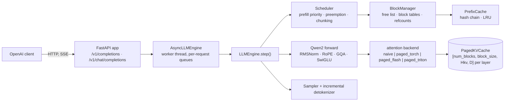

# pagedserve

A from-scratch LLM inference engine in PyTorch, built to understand what vLLM does and
to measure how far a one-person implementation lands from it on the same GPU and model.

* Qwen2.5-0.5B-Instruct forward pass written here (RMSNorm, RoPE, GQA, SwiGLU, safetensors
  loader); `transformers` is used only for the tokenizer and as the golden reference.
* Continuous batching with a prefill-priority, iteration-level scheduler; block-gated
  admission; recompute preemption; optional chunked prefill.
* Paged KV cache with block tables, refcounted block sharing, and hash-chained automatic
  prefix caching with LRU eviction.
* Four interchangeable attention backends behind one contract: `naive`, `paged_torch`
  (gather, the reference), `paged_flash` (flash-attn paged decode + varlen prefill), and
  `paged_triton` (a hand-written Triton PagedAttention decode kernel with GQA head packing,
  online softmax and split-K).
* CUDA-graph decode at batch buckets.
* OpenAI-compatible server (`/v1/completions`, `/v1/chat/completions`, SSE streaming,
  disconnect cancellation, `/metrics`).
* A benchmark harness (ShareGPT-like traces, Poisson arrivals, in-process ablation, HTTP
  load generator) and a vLLM baseline runner, so every claim below is one command to re-run.

Correctness gate: greedy output is token-for-token identical to Hugging Face on 7 prompts x
64 tokens, and prompt logits match within 1e-3, on every backend (fp32 exact; fp16 held to a
self-calibrated tie-break rule described below). 176 CPU tests on a 2-layer random-weight model (no download, no GPU) and 31 GPU tests.

## Headline numbers

Qwen2.5-0.5B-Instruct fp16, 200-request ShareGPT-like trace (prompt median 208 tokens,
output median 131), seed 0, same trace for every row. Raw files in `results/`.

| | RTX 4090 | A100 SXM 80 GB |
|---|---:|---:|
| naive per-sequence cache, 8 req/s | 343 tok/s | |
| paged_flash + CUDA graphs, 8 req/s | 1,441 tok/s, TPOT p50 3.8 ms | 1,320 tok/s, TPOT p50 6.2 ms (HTTP) |
| paged_flash + CUDA graphs, all 200 at t=0 | 5,459 tok/s (in-process) | **6,417 tok/s** (HTTP) |
| vLLM, same trace, same GPU, 8 req/s | | 1,377 tok/s, TPOT p50 2.1 ms |
| vLLM, all 200 at t=0 | | 16,269 tok/s |
| Triton decode kernel vs flash-attn, B=128 / ctx 2048 | 4.2x slower (first version) | **1.16x** slower (835 vs 972 GB/s) |
| KV-cache slot utilization, block 16 vs 256 | | **98% vs 76%** |

Against vLLM on the A100: throughput parity to 8 req/s, 91% at 16 req/s, 39% at saturation,
up from 23% two commits earlier. The [gap analysis](#the-gap-against-vllm) has the per-phase
profile and the fixes it drove.

## How it works



### The step loop

`LLMEngine.step()` is `schedule -> build inputs -> forward -> sample -> postprocess`. Each
step is either a **prefill batch** (new or re-admitted requests, packed with no padding,
bounded by `max_num_batched_tokens`) or a **decode batch** (one token for every running
request). Tokens are packed `[num_tokens, heads, head_dim]` with `cu_seqlens`, never padded.

### Scheduler

Prefill has priority: whenever the waiting queue is non-empty and the request's blocks can be
allocated, the step is a prefill; otherwise it is a decode over everything running. Admission
is block-gated FIFO, so a request never starts unless its prompt fits. When decode runs out of
blocks, the youngest running request is preempted by recompute (blocks freed,
`num_computed_tokens` reset, back to the front of the queue). Outputs are identical with or
without preemption; that is a test.

With `--enable-chunked-prefill` (Sarathi-Serve / vLLM style) a step is instead **mixed**: one
decode token for every running request whose prefill is done, plus as many prompt tokens as
fit in the remaining `max_num_batched_tokens` (mid-prefill requests first, then new ones). A
long prompt is split across steps, so it no longer stalls every decoder's TPOT for one long
step, and prompts longer than the budget are accepted. A partial chunk writes K/V and emits
nothing; the token is sampled only on the step that completes the prompt
(`SchedulerOutput.prefill_complete`). Chunked outputs equal unchunked outputs; also a test.

### Paged KV cache

Each layer's cache is one tensor `[num_blocks, block_size, Hkv, D]` for K and one for V.
A sequence owns a **block table** (list of physical block ids); token position `p` lives at
slot `table[p // block_size] * block_size + p % block_size`. The `BlockManager` keeps the
free list, allocates a block when the previous one fills, refcounts blocks so prefixes can be
shared, and reports utilization (`slots in use / slots allocated`). Memory waste is bounded by
one partial block per sequence, which is why block size is an ablation knob and not a detail.

For Qwen2.5-0.5B in fp16 one token of K+V across 24 layers is `2 * 24 * 2 * 64 * 2 B = 12 KB`;
20 GB of cache holds ~1.6 M tokens.

### Prefix caching

Every full block is hashed by the chain `(parent_hash, token_ids_in_block)`. A new request
looks up its prompt's leading full blocks, skips those tokens in prefill (attention still sees
them: `context_lens` counts cached positions and the queries are the last `query_len` of the
context), and shares the physical blocks by refcount. Unreferenced cached blocks sit in an
LRU and are evicted when the free list runs dry. A fully cached prompt still computes at least
its last token so there is a logit to sample from.

### Attention backends

All four implement one contract (`attn/base.py`): given packed Q/K/V for this step, write K/V
into the cache at the step's slots, then attend causally where `context_lens[i]` is the KV
length *after* the write.

| backend | decode | prefill | block size | notes |
|---|---|---|---|---|
| `naive` | per-sequence `torch.cat` cache | same | n/a | what "no KV cache management" looks like |
| `paged_torch` | `index_select` blocks into a padded `[B, max_ctx, Hkv, D]`, masked softmax | same | any | the reference for every other backend's tests |
| `paged_flash` | `flash_attn_with_kvcache(block_table=...)` | `flash_attn_varlen_func` | multiple of 256 | upstream flash-attn hard-checks `page_block_size % 256` |
| `paged_triton` | hand-written Triton kernel, grid `(B, Hkv, splits)` | delegated to `paged_flash` when the block size allows, else `paged_torch` | multiple of 16 | one program owns one sequence, one KV head and all its GQA query heads; online softmax; split-K past 1k keys; `tl.dot` on tensor cores |

`paged_triton` exists because flash-attn's block-256 constraint is not free: at block 256 a
64-token shared prefix never fills a block and gets zero cache hits, and KV utilization drops
to 76%. The Triton kernel makes block 16 usable on the GPU.

### CUDA graphs

`--enable-cuda-graphs` captures the decode forward once per batch bucket (1, 2, 4, ..., 256)
into static input buffers; a step replays the bucket at or above its batch size with padded
rows pointed at one reserved scratch block. Graphs are worth more than any kernel at this
model size: the kernels themselves take a couple of milliseconds across 24 layers and the rest was launch overhead,
so TPOT fell from 9.1 to 3.8 ms on the 4090.

## Correctness

```bash
make golden        # dump HF greedy + logits -> golden/, then check every CPU backend
python scripts/check_golden.py --device cuda --dtype float16 --backends paged_flash,paged_triton --block-size 256
```

fp32 runs must match the fp32 Hugging Face reference exactly: logits within 1e-3 and tokens
token-for-token, on all 7 prompts decoded together in one continuous batch (so batching,
paging and prefix sharing are all under test at once). Half-precision runs are compared to
the same fp32 reference, so the gate is self-calibrated: the logits bar is 1.0 and a token
flip counts as a numeric tie-break, not a failure, only when the top-2 logit gap at that
position is below 2x the logits error measured on prompt 0, i.e. the two candidates were
closer than the run's own precision noise. Two gotchas this gate caught: Qwen2.5's
`generation_config.json` sets `repetition_penalty=1.05`, so `model.generate()` is not greedy
unless every knob is overridden; and `apply_chat_template` in transformers 5 returns an
encoding, not a string.

```bash
make test                          # 176 CPU tests, 2-layer random model, no download
python -m pytest -m gpu -n 4 -v    # 31 GPU tests: flash/triton kernels vs paged_torch, engine parity, graph capture
```

## Results

All runs: Qwen2.5-0.5B-Instruct fp16, 200 requests, seed 0, `max_model_len 4096`. TTFT is
time to first token, TPOT is time per output token after the first, both per request.

### RTX 4090 ablation (`results/ablation*.json`, block size 256, torch 2.8.0+cu128)

**Open-loop, 8 req/s** (arrivals span 24.3 s; a config that keeps up finishes in ~25 s):

| config | tok/s | run | TTFT p50/p99 ms | TPOT p50/p99 ms | e2e p50 |
|---|---:|---:|---:|---:|---:|
| naive (per-seq `torch.cat`) | 343 | ~108 s | – | – | – |
| static batching | 595 | ~62 s | – | – | – |
| paged_torch | 700 | 52.8 s | 12.2 / 27.9 | 86.2 / 141 | 12.7 s |
| paged_flash | 1,329 | 27.8 s | 8.7 / 10.0 | 9.1 / 9.9 | 1.21 s |
| paged_flash + CUDA graphs | **1,441** | 25.6 s | 8.7 / 10.6 | **3.8 / 4.8** | 0.52 s |

**Saturation, all 200 at t=0:** paged_torch 738 -> paged_flash 3,043 -> +graphs **5,459 tok/s**
(TTFT p50 279 ms, TPOT p50 12.4 ms).

**Prefix caching, 8 req/s:** a 64-token shared prefix did nothing at block 256 (no full block
is ever shared). A 512-token prefix moved TTFT p99 from 10.3 to 9.5 ms and nothing else,
because prefill on a 0.5B model is ~8 ms to begin with.

### A100 SXM 80 GB, decode-attention kernel (`results/kernels_a100_*.json`)

Decode attention only, H=14, Hkv=2, D=64, fp16, median of 20 calls. Ratio = Triton kernel
time / flash-attn time (1.0 = parity); the `tl.dot` tensor-core variant is the default.

| Triton block | ctx | B=1 | B=8 | B=32 | B=128 |
|---|---|---|---|---|---|
| 256 | 128 | 2.04x | 1.98x | 1.98x | 1.92x |
| 256 | 512 | 2.40x | 2.31x | 2.25x | 1.73x |
| 256 | 2048 | 2.26x | 2.25x | 1.93x | **1.16x** (835 vs 972 GB/s) |
| 16 | 2048 | 2.26x | 2.24x | 1.92x | 1.54x |

The first version of the kernel (broadcast-multiply, CUDA cores) was 3.3x–10.8x behind on the
same GPU and 4.2x behind on the 4090. Moving QK^T and PV onto tensor cores (`tl.dot`, query
heads padded 7 -> 16) closed the gap at large batch; what remains is a flat ~0.04 ms per call
that does not scale with work, so short contexts and small batches stay ~2x behind.
`paged_torch` on the same shape: 7.41 ms, 18 GB/s.

### A100, pagedserve over HTTP vs vLLM (`results/vllm.json`, `results/pagedserve_*.json`)

Same load generator, same trace, same GPU, both servers fp16 with `max_model_len 4096`.
pagedserve: `paged_flash`, block 256, CUDA graphs. vLLM from its own venv, defaults.

| req/s offered | vLLM tok/s | pagedserve tok/s | vLLM TTFT p50 | pagedserve TTFT p50 | vLLM TPOT p50/p99 | pagedserve TPOT p50/p99 |
|---:|---:|---:|---:|---:|---:|---:|
| 1 | 177 | 177 | 12.9 ms | 23.8 ms | 2.0 / 2.3 | 4.4 / 5.3 |
| 2 | 354 | 350 | 11.9 | 23.7 | 2.0 / 2.2 | 4.8 / 5.8 |
| 4 | 701 | 685 | 11.6 | 24.4 | 2.1 / 2.2 | 5.5 / 6.7 |
| 8 | 1,377 | 1,320 | 12.0 | 25.6 | 2.1 / 2.3 | 6.2 / 8.1 |
| 16 | 2,659 | 2,409 | 12.0 | 27.5 | 2.2 / 2.4 | 9.6 / 13.0 |
| all at t=0 | **16,269** | **6,417** | 421 | 588 | 8.1 / 12.8 | 16.0 / 29.8 |

Rates 1–8 are latency comparisons (throughput equals offered load for both); 16 and the
saturation row compare capacity. The `paged_triton` server at block 16 matches these to
8 req/s but pays +8 ms TTFT (its fresh-prompt prefill still goes through the gather path)
and 1.7 s TTFT at saturation; `results/pagedserve_triton.json`.

### The gap against vLLM

`scripts/profile_step.py` times one decode step per phase at fixed batch sizes, with a
device sync inside `forward` so GPU time lands there (A100, `paged_flash` + graphs, ms):

| batch | schedule | build_inputs | forward | sample | postprocess | total |
|---:|---:|---:|---:|---:|---:|---:|
| 1 | 0.01 | 0.15 | **3.93** | 0.08 | 0.03 | 4.22 |
| 32 | 0.03 | 0.44 | 4.47 | 1.73 | 0.47 | 7.18 |
| 200 (before) | 0.17 | 2.00 | 6.17 | **10.79** | 2.85 | 22.02 |
| 200 (after `0987fda`) | 0.17 | 2.01 | 6.18 | 0.31 | 2.86 | 11.58 |

Three findings, two of them fixed the same night:

1. **One CUDA sync per sequence per step.** The sampler looped over rows and called
   `.item()` on each, so a 200-sequence step paid 200 device round-trips: 10.8 of 22 ms.
   Batched argmax (and batched temperature / top-k / top-p with per-row parameters, keeping
   per-request generators) makes it one `.tolist()` per step. Saturation throughput
   3,717 -> 4,739 tok/s.
2. **Per-token CPU work that scaled with output length.** The detokenizer re-decoded a
   request's entire output every step (O(length), invisible in the short-output profile),
   and the SSE loop polled `request.is_disconnected()` per token per stream. A sliding-window
   incremental detokenizer (the two-offset scheme vLLM and TGI use) and dropping the poll
   (sse-starlette already cancels the generator on disconnect): 4,739 -> 6,417 tok/s, TPOT
   at 16 req/s 12.9 -> 9.6 ms.
3. **A 3.9 ms forward at batch 1, inside a CUDA graph.** Graphs removed launch *overhead*,
   but every kernel still costs 3–4 us of GPU time, and this model runs ~42 kernels per
   layer (unfused RMSNorm, rotate-half RoPE, separate q/k/v and gate/up projections):
   ~1,000 kernels per step. vLLM runs ~10 per layer. This is the floor under our 4.4 ms
   TPOT at 1 req/s against vLLM's 2.0, and it is the next fix: fused QKV and gate-up
   weights, then Triton kernels for RMSNorm+residual, RoPE, and SiLU-mul.

What is left after that is architectural. vLLM runs its scheduler in a separate process
from the API server and overlaps step N+1's CPU work with step N on the GPU; pagedserve
runs scheduling, sampling, detokenization and SSE delivery on one interpreter, so at 200
streams the server's per-token work and the engine's per-step work serialize on the GIL.
That is the remaining factor between 6.4k and 16k tok/s.

### What the numbers taught us

* **Launch overhead dominates a 0.5B model, then kernel count does.** The 4090 decode step
  is ~3.6 ms wall with graphs and ~9 ms without; the attention kernel itself is ~0.1 ms.
  Kernel choice moved throughput 2x (paged_torch -> paged_flash); removing launches moved
  TPOT 2.4x; and the A100 profile shows the graph still replays ~1,000 tiny kernels per
  step. Nothing about this model is compute-bound at these batch sizes.
* **Measure the step, not the kernel.** The two largest end-to-end wins so far (sampler
  syncs, O(n) detokenization) were Python, found only by timing phases with a device sync
  in the right place. The kernel micro-benchmark could not have shown either.
* **Block size is a memory-vs-kernel trade.** Block 16 gives 98% slot utilization and makes
  short shared prefixes cacheable; flash-attn demands 256 and gives 76%. On an 80 GB card with
  a 0.5B model the waste never bites (nothing was ever preempted), which is exactly why the
  ablation has to say so rather than assume paging "saves memory" here.
* **Prefix caching needs prefixes.** With ShareGPT-like traces and no system prompt it is a
  no-op; with a 512-token shared prefix it saves ~1 ms of an ~9 ms TTFT. It pays on long
  shared system prompts, which this trace does not have.
* **Chunked prefill needs long prompts.** On a 208-token-median trace it changes nothing
  measurable; the long-prompt trace (1.5–2k tokens at a higher rate) is queued.

## Run it

### Locally (Mac / CPU, fp32)

```bash
pip install -e '.[hf,server,dev]'
python scripts/download_model.py                 # ~1 GB into models/
make golden                                      # HF reference -> golden/, then check naive + paged_torch
python -m pagedserve.cli generate --model models/Qwen2.5-0.5B-Instruct --prompt "The capital of France is" --max-tokens 32
python -m pagedserve.cli serve --model models/Qwen2.5-0.5B-Instruct --port 8000
```

Then any OpenAI client works:

```python
from openai import OpenAI
client = OpenAI(base_url="http://localhost:8000/v1", api_key="x")
for chunk in client.chat.completions.create(model="models/Qwen2.5-0.5B-Instruct",
        messages=[{"role": "user", "content": "Explain paged attention in one sentence."}],
        stream=True, max_tokens=64):
    print(chunk.choices[0].delta.content or "", end="", flush=True)
```

### On a GPU

`README_GPU.md` covers the pod setup (`scripts/pod_setup.sh` does it in one shot), the
flash-attn block-256 constraint, the vLLM venv, the Triton kernel knobs, CUDA-graph debugging,
and the pitfalls we hit. The serving config used for the numbers above:

```bash
python -m pagedserve.cli serve --model models/Qwen2.5-0.5B-Instruct --device cuda --dtype float16 \
  --attn-backend paged_triton --block-size 16 --enable-cuda-graphs --enable-prefix-caching
```

### Benchmarks

```bash
# in-process ablation: one command, every backend at its own minimum block size
python -m pagedserve.bench.ablation --model models/Qwen2.5-0.5B-Instruct --device cuda --dtype float16 \
  --configs naive,static,paged_torch,paged_flash,paged_flash+graphs,paged_triton,paged_triton+graphs,paged_triton+graphs+prefix \
  --trace-n 200 --request-rate 8 --shared-prefix-len 64 --block-size 16 --out results/ablation.json
python -m pagedserve.bench.ablation ... --request-rate inf --out results/ablation_sat.json      # saturation

# HTTP rate sweeps, same trace, vLLM then pagedserve
python -m pagedserve.bench.run_vllm_baseline --server vllm --vllm-bin /opt/vllm/bin/vllm \
  --model Qwen/Qwen2.5-0.5B-Instruct --dtype float16 --max-model-len 4096 --rates 1,2,4,8,16,inf --trace-n 200 --name vllm
python -m pagedserve.bench.run_vllm_baseline --server pagedserve --model models/Qwen2.5-0.5B-Instruct \
  --dtype float16 --max-model-len 4096 \
  --server-args "--device cuda --attn-backend paged_triton --block-size 16 --enable-cuda-graphs" \
  --rates 1,2,4,8,16,inf --trace-n 200 --name pagedserve_triton

# kernel micro-benchmark and figures
python scripts/bench_kernels.py                  # ms/call + effective K/V GB/s, Triton vs flash ratio table
python -m pagedserve.bench.plot results/vllm.json results/pagedserve_triton.json --ablation results/ablation.json --out-dir results/plots
```

`run_vllm_baseline --base-url https://...` points the same load generator at any live
OpenAI-compatible endpoint, which is how a hosted-API row gets added.

## Layout

```
pagedserve/
  config.py            ModelConfig (mirrors HF config.json) / EngineConfig (block_size, backend, knobs)
  model/               qwen2.py (from scratch), rope.py, weights.py (safetensors -> our modules)
  attn/                base.py (AttnMetadata + backend contract, packed token layout)
                       naive.py | paged_torch.py | paged_flash.py | paged_triton.py | cuda_graphs.py
  kv/                  block_manager.py, cache.py (paged K/V tensors), prefix_cache.py
  sched/               request.py, scheduler.py (prefill-priority, preemption, chunked prefill)
  sampling.py          per-request temperature / top-k / top-p / repetition penalty / seeds / stop
  engine.py            LLMEngine.step(): schedule -> build inputs -> forward -> sample -> postprocess
  llm.py               offline LLM.generate()
  tokenizer.py         HF tokenizer wrapper + incremental detokenizer (stop strings)
  server/              AsyncLLMEngine (worker thread), OpenAI types, FastAPI app
  bench/               trace, load, metrics, offline, ablation, run_vllm_baseline, plot
scripts/               download_model, dump_golden, check_golden, gpu_smoke, bench_kernels,
                       gpu_debug_capture, pod_setup.sh
tests/                 one file per component; *_gpu.py need CUDA; test_engine.py holds the end-to-end gates
results/               every JSON the tables above were built from
```

## Roadmap

* Kernel fusion for the batch-1 forward floor (fused QKV / gate-up; Triton RMSNorm+residual, RoPE, SiLU-mul).
* Engine core in its own process with async scheduling (the vLLM v1 layout), for the saturation gap.
* Route fresh-prompt prefill for `paged_triton` at block 16 through flash varlen (today it
  falls back to `paged_torch`, costing ~8 ms of TTFT).
* Chunked-prefill ablation on a long-prompt trace.
* Hosted-API footnote (DeepSeek, Kimi via OpenRouter) through `--base-url`.
* Speculative decoding; Runpod Serverless deployment.

## References

* Kwon et al., *Efficient Memory Management for Large Language Model Serving with
  PagedAttention* (SOSP 2023), the vLLM paper.
* Yu et al., *Orca: A Distributed Serving System for Transformer-Based Generative Models*
  (OSDI 2022), iteration-level scheduling.
* Agrawal et al., *Taming Throughput-Latency Tradeoff in LLM Inference with Sarathi-Serve*
  (OSDI 2024), chunked prefill.
* Dao, *FlashAttention-2* and the flash-decoding split-K write-up.
