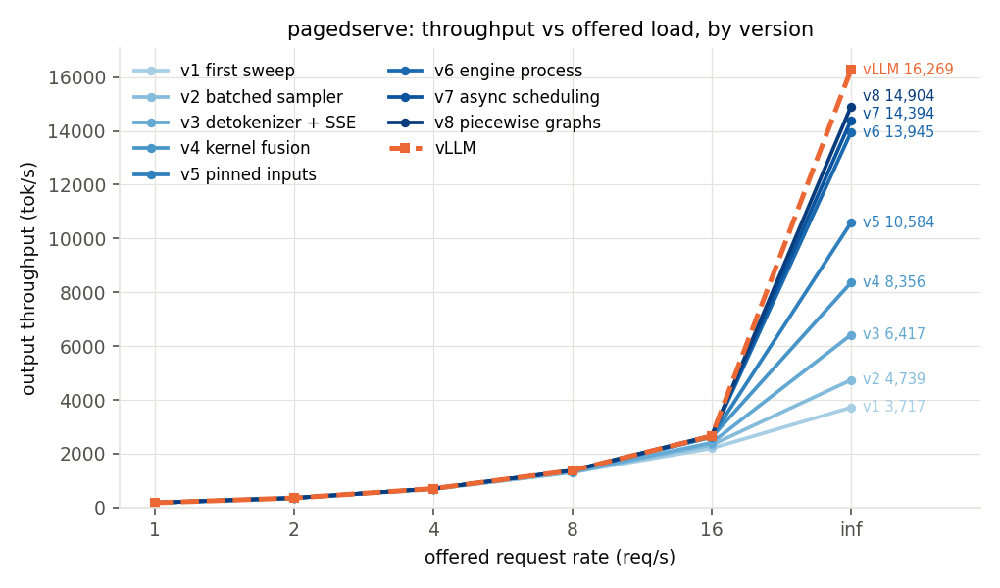
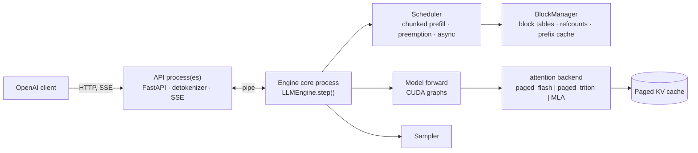

# pagedserve

[](https://github.com/ashwinsreedhar28/pagedserve/actions/workflows/ci.yml)

A from-scratch LLM inference engine in PyTorch (paged KV cache, continuous batching, CUDA
graphs, an OpenAI-compatible server), built to understand what vLLM does and measured
against it on the same GPUs. It matches vLLM's throughput at 7B, and on a cold start it is
serving while vLLM is still compiling.

## Documentation

| | |
|---|---|
| [How it works](docs/design.md) | step loop, scheduler, paged KV cache, prefix caching, attention backends, MLA + MoE, CUDA graphs, int8, tensor parallelism, correctness |
| [Results in depth](docs/results.md) | ablations, kernels, the benchmark correction, every sweep against vLLM, the fix history, real text, the 7B tail |
| [Cold start](docs/cold-start.md) | A100 pods and Runpod Serverless, phase by phase |
| [Models](docs/models.md) | per-model results; hosted APIs for scale |
| [Running it](docs/running.md) · [GPU notes](docs/gpu.md) | local, GPU pods, Runpod Serverless, benchmark commands; pod pitfalls |
| [Roadmap](docs/roadmap.md) | what is open |
| [scripts/](scripts/README.md) · [results/](results/README.md) · [deploy/runpod/](deploy/runpod/README.md) | which script does what; which result file backs which number; the Serverless worker |

## Results

### Cold start on Runpod Serverless

Qwen3-8B, one RTX 4090 worker, Runpod's own `delayTime` for a job sent to an endpoint at
zero workers, every sample a full cold boot (FlashBoot off, or on and missed), against
Runpod's official vLLM worker on the same GPU tier:

| cold start, `delayTime` | host already has the image | fresh host |
|---|---:|---:|
| pagedserve, weights baked into the image | **17.2 s** | 328.4 s |
| **pagedserve, small image, weights streamed in at start** | **32.8 s** | **91.7 s** |
| worker-vllm v2.28.0 (vLLM 0.30.0) | 147.5 s | 210.4 s |

The worker reports a wall-clock timeline of its own startup, so every second is attributed.
In its log, worker-vllm spends 52 s between launch and the start of model loading (three
Python processes starting and importing one after another, plus ~10 s of config
resolution), before its 22 s download, and 33 s in torch.compile from an empty cache.
Baking the weights in made pagedserve fast on a warm host, but a fresh host spent 317 s
pulling the 27 GB image. So the small image downloads the weights from Hugging Face and
loads each shard into the GPU the moment it lands, while the engine is already starting;
since Sep 30 it also sizes its KV cache and captures its CUDA graphs on the empty model
during the download, which cut the time from the last shard landing to the engine's
boot line from 5.7 s to 2.2 s (median, 3 vs 6 samples) and the small image's warm median from 37.9 s to
32.8 s. Most of what is left is the 15–25 s Hugging Face download itself. Warm hosts:
median of four runs for the small image, three for the baked one, two for worker-vllm;
fresh hosts: one sample each.
[Details](docs/cold-start.md#on-runpod-serverless-pagedserve-vs-worker-vllm-resultsserverless_coldstart_qwen3)

### Cold start on an A100 (process start → first token)

| Qwen3-8B, same pod, weights on local disk | runs 2–3 | first run |
|---|---:|---:|
| **pagedserve** | **6.7 s** | 6.7 s |
| vLLM 0.30.0, defaults (compile cache warm after run 1) | 69.1 s | 202.3 s |
| vLLM 0.30.0, `--enforce-eager` | 55.2 s | 57.0 s |

A streaming safetensors loader (parallel reads into pinned buffers, copies overlapped on a
side stream: 14 GB/s vs vLLM's ~0.65 GB/s) and an engine process that starts before the
server has imported anything. The 7B: 5.6 s.
[Details](docs/cold-start.md#cold-start-process-start-to-first-token-resultscoldstart)

### Throughput and latency against vLLM

Same A100, same load generator, a fresh server per run and a different trace per rate
([why that matters](docs/results.md#a-correction-the-sweeps-replayed-one-trace-and-vllm-cached-it)):

| Qwen2.5-7B-Instruct, fp16 | TPOT p50, pagedserve | TPOT p50, vLLM | tok/s, pagedserve / vLLM |
|---|---:|---:|---:|
| 2 req/s | 10.41 ms | 10.32 ms | 341 / 341 |
| 4 req/s | 11.15 ms | 10.86 ms | 728 / 728 |
| 8 req/s | 12.35 ms | 11.98 ms | 1,274 / 1,276 |
| 16 req/s | **15.85 ms** | 16.05 ms | parity |
| all 200 requests at once | **27.07 ms** | 29.20 ms | **3,412 / 3,415** |

Qwen3-8B: parity at 16 req/s (TPOT 20.90 vs 20.98 ms), 96% of vLLM's throughput at
saturation. Qwen2.5-0.5B with two API processes (`serve --api-workers 2`): 28.0k vs 25.1k
tok/s on real ShareGPT text, 112%. Also measured: DeepSeek-R1-Distill-Llama-8B, and
Moonlight-16B-A3B, a DeepSeek-V3-style model with latent attention and mixture of experts
([Models](docs/models.md#models)).



From 23% of vLLM's saturation throughput to parity at 0.5B in nine profile-driven fixes
([the fix history](docs/results.md#the-gap-against-vllm)).

### How the numbers were earned

* **Profile, fix, re-measure.** One sync per sequence in the sampler, per-token detokenizing,
  ~42 kernels per layer, a shared GIL, a GPU idling while Python built the next step, and
  finally the API process's SSE writes: each found by timing the step, each fixed, each
  re-measured over HTTP.
* **Repeats, not lucky runs.** A single synthetic saturation run said 92% of vLLM; eight
  repeats on real text said 81 ± 6%, and the spread itself led to the next fix. Every
  number here is a mean or a median, with the individual runs in `results/`.
* **Catching my own benchmark.** The sweep harness replayed one trace at every rate, and
  vLLM's prefix cache served the later rates from memory (hit rate up to 64%). Fixed and
  re-measured, the 7B "gap" turned out to be parity. The rows not yet re-measured are marked.
* **Measuring the whole path.** On Serverless the engine was never the only cost; a
  per-phase timeline showed the image pull dominating a fresh host, and that picked the
  design.
* **Correct before fast.** Greedy output matches Hugging Face token for token in fp32 (the
  naive and paged_torch backends); in fp16/bf16, on every backend, a divergence passes only
  as a measured near-tie between the two tokens.

## What's inside

* Model code written here: Qwen2/Qwen2.5, Qwen3, Llama 3, Mistral (RMSNorm, RoPE, GQA,
  SwiGLU) and DeepSeek-V2/V3 (multi-head latent attention, mixture of experts);
  `transformers` is used only for the tokenizer and as the correctness reference.
* Continuous batching: iteration-level scheduler, chunked prefill, recompute preemption,
  async scheduling (step N+1 launched before step N's tokens are read back).
* Paged KV cache with block tables, refcounted sharing, and hash-chained prefix caching with
  LRU eviction.
* Attention backends behind one contract: `paged_flash` (flash-attn), `paged_triton` (a
  hand-written Triton PagedAttention decode kernel with split-K), MLA kernels, and reference
  paths.
* Full-step and piecewise CUDA graphs; fused Triton RMSNorm / RoPE / SiLU; fused MoE grouped
  GEMM.
* Tensor parallelism (Megatron-style sharding), weight-only int8, n-gram speculative
  decoding.
* An OpenAI-compatible server (`/v1/completions`, `/v1/chat/completions`, SSE streaming,
  `/metrics`), the engine in its own process, optional extra API processes.
* A streaming safetensors loader that can load while the checkpoint is still downloading,
  and a Runpod Serverless worker (queue and load-balancer endpoints).
* A benchmark harness (synthetic and ShareGPT traces, Poisson arrivals, a vLLM baseline
  runner, per-step GPU tracing, cold-start timelines), so every claim here is one command
  to re-run.

Correctness gate: in fp32, greedy output is token-for-token identical to Hugging Face on 7
prompts × 64 tokens and prompt logits match, on the fp32 backends (naive, paged_torch);
fp16/bf16 runs (paged_flash, paged_triton, the MLA backends) are held to a
self-calibrated rule (a token may differ only where the engine's own logits put both tokens
within the run's measured noise of the top). 410+ CPU tests on a tiny random-weight model
(no download, no GPU), plus the GPU suite on the pod.



## Quickstart

On a Mac or any CPU (fp32):

```bash
pip install -e '.[hf,server,dev]'
python scripts/download_model.py                 # Qwen2.5-0.5B-Instruct, ~1 GB into models/
python -m pagedserve.cli serve --model models/Qwen2.5-0.5B-Instruct --port 8000
```

Then any OpenAI client works:

```python
from openai import OpenAI
client = OpenAI(base_url="http://localhost:8000/v1", api_key="x")
for chunk in client.chat.completions.create(model="models/Qwen2.5-0.5B-Instruct",
        messages=[{"role": "user", "content": "Explain paged attention in one sentence."}],
        stream=True, max_tokens=64):
    print(chunk.choices[0].delta.content or "", end="", flush=True)
```

GPU setup, the benchmark commands and the Runpod Serverless worker are in
[docs/running.md](docs/running.md).

## Layout

```
pagedserve/            the engine
  engine.py            LLMEngine.step(): schedule → build inputs → forward → sample → postprocess
                       (async scheduling: launch step N+1, then resolve step N)
  sched/               scheduler: chunked prefill, preemption, async lookahead
  kv/                  block manager, paged K/V and latent caches, prefix cache
  attn/                backend contract; paged_flash, paged_triton (Triton decode kernel), MLA,
                       reference paths; CUDA graphs
  model/               Qwen2/Qwen3/Llama/Mistral block, DeepSeek MLA + MoE, fused Triton ops,
                       int8, safetensors loaders (fastload.py: the streaming loader)
  server/              OpenAI-compatible app, engine-core process, extra API processes,
                       early engine start
  sampling.py · spec.py · dist.py · tokenizer.py · steptrace.py · cli.py
  bench/               traces, load generator, metrics, vLLM baseline runner, plots
docs/                  the long-form documentation (table above)
scripts/               setup, correctness, benchmarks, profiling, recorded pod sessions (index inside)
results/               every file a number in the docs comes from (index inside)
deploy/runpod/         Serverless worker, Dockerfiles (baked, small), deploy notes
tests/                 one file per component; *_gpu.py need CUDA; end-to-end gates in test_engine.py
golden/                Hugging Face reference outputs for the correctness gate
```

## What's next

* Cold start: a steadier download with `HF_TOKEN` (it is now most of a warm start), shards
  fetched in load order so loading overlaps the download (the last ~2 s), the Triton cache
  in the image (first request 1.3–2.1 s), more fresh-host samples, then CUDA
  checkpoint/restore inside a container.
* Re-measure the vLLM rows still marked as from the replayed-trace harness (R1-8B,
  Moonlight, TP2, ShareGPT sweeps).
* Where a 7B step could beat vLLM's: mixed-step GEMM tiling, one paged varlen attention
  call, fused elementwise ops. The full list is the [roadmap](docs/roadmap.md).

## License

MIT.

## References

* Kwon et al., *Efficient Memory Management for Large Language Model Serving with
  PagedAttention* (SOSP 2023), the vLLM paper.
* Yu et al., *Orca: A Distributed Serving System for Transformer-Based Generative Models*
  (OSDI 2022), iteration-level scheduling.
* Agrawal et al., *Taming Throughput-Latency Tradeoff in LLM Inference with Sarathi-Serve*
  (OSDI 2024), chunked prefill.
* Dao, *FlashAttention-2* and the flash-decoding split-K write-up.
