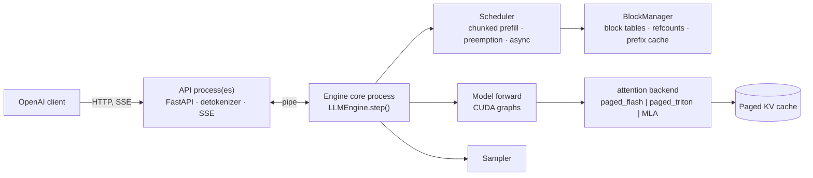

# pagedserve

[](https://github.com/ashwinsreedhar28/pagedserve/actions/workflows/ci.yml)

A from-scratch LLM inference engine in PyTorch (paged KV cache, continuous batching, CUDA
graphs, an OpenAI-compatible server), built to understand what vLLM does and measured
against it on the same GPUs. It matches vLLM's throughput at 7B, and on a cold start it is
serving while vLLM is still compiling.

## Results

### Cold start on Runpod Serverless

Qwen3-8B, one RTX 4090 worker, Runpod's own `delayTime` for a job sent to an endpoint at
zero workers (FlashBoot off), against Runpod's official vLLM worker on the same GPU tier:

| cold start, `delayTime` | host already has the image | fresh host |
|---|---:|---:|
| pagedserve, weights baked into the image | **17.2 s** | 328.4 s |
| **pagedserve, small image, weights streamed in at start** | **37.9 s** | **91.7 s** |
| worker-vllm v2.28.0 (vLLM 0.30.0) | 147.5 s | 210.4 s |

The worker reports a wall-clock timeline of its own startup, so every second is attributed.
In its log, worker-vllm spends 52 s importing Python across three processes and 33 s in
torch.compile from an empty cache. Baking the weights in made pagedserve fast on a warm host, but a fresh
host spent 317 s pulling the 27 GB image. So the small image downloads the weights from
Hugging Face and loads each shard into the GPU the moment it lands, while the engine is
already starting. Warm hosts: median of three runs for pagedserve, two for worker-vllm;
fresh hosts: one sample each.
[Details](docs/cold-start.md#on-runpod-serverless-pagedserve-vs-worker-vllm-resultsserverless_coldstart_qwen3)

### Cold start on an A100 (process start → first token)

| Qwen3-8B, same pod, weights on local disk | runs 2–3 | first run |
|---|---:|---:|
| **pagedserve** | **6.7 s** | 6.7 s |
| vLLM 0.30.0, defaults (compile cache warm after run 1) | 69.1 s | 202.3 s |
| vLLM 0.30.0, `--enforce-eager` | 55.2 s | 57.0 s |

A streaming safetensors loader (parallel reads into pinned buffers, copies overlapped on a
side stream: 14 GB/s vs vLLM's ~0.65 GB/s) and an engine process that starts before the
server has imported anything. The 7B: 5.6 s.
[Details](docs/cold-start.md#cold-start-process-start-to-first-token-resultscoldstart)

### Throughput and latency against vLLM

Same A100, same load generator, a fresh server per run and a different trace per rate
([why that matters](docs/results.md#a-correction-the-sweeps-replayed-one-trace-and-vllm-cached-it)):

| Qwen2.5-7B-Instruct, fp16 | TPOT p50, pagedserve | TPOT p50, vLLM | tok/s, pagedserve / vLLM |
|---|---:|---:|---:|
| 2 req/s | 10.41 ms | 10.32 ms | 341 / 341 |
| 4 req/s | 11.15 ms | 10.86 ms | 728 / 728 |
| 8 req/s | 12.35 ms | 11.98 ms | 1,274 / 1,276 |
| 16 req/s | **15.85 ms** | 16.05 ms | parity |
| all 200 requests at once | **27.07 ms** | 29.20 ms | **3,412 / 3,415** |

Qwen3-8B: parity at 16 req/s (TPOT 20.90 vs 20.98 ms), 96% of vLLM's throughput at
saturation. Qwen2.5-0.5B with two API processes (`serve --api-workers 2`): 28.0k vs 25.1k
tok/s on real ShareGPT text, 112%. Also measured: DeepSeek-R1-Distill-Llama-8B, and
Moonlight-16B-A3B, a DeepSeek-V3-style model with latent attention and mixture of experts
([Models](docs/models.md#models)).


From 23% of vLLM's saturation throughput to parity at 0.5B in nine profile-driven fixes
([the fix history](docs/results.md#the-gap-against-vllm)).

### How the numbers were earned

* **Profile, fix, re-measure.** One sync per sequence in the sampler, per-token detokenizing,
  ~42 kernels per layer, a shared GIL, a GPU idling while Python built the next step, and
  finally the API process's SSE writes: each found by timing the step, each fixed, each
  re-measured over HTTP.
* **Repeats, not lucky runs.** Eight repeats of a "92%" saturation run said 81 ± 6%. Every
  number here is a mean or a median, with the individual runs in `results/`.
* **Catching my own benchmark.** The sweep harness replayed one trace at every rate, and
  vLLM's prefix cache served the later rates from memory (hit rate up to 64%). Fixed and
  re-measured, the 7B "gap" turned out to be parity. The rows not yet re-measured are marked.
* **Measuring the whole path.** On Serverless the engine was never the only cost; a
  per-phase timeline showed the image pull dominating a fresh host, and that picked the
  design.
* **Correct before fast.** Greedy output matches Hugging Face token for token on every
  backend and model.

## What's inside

* Model code written here: Qwen2/Qwen2.5, Qwen3, Llama 3, Mistral (RMSNorm, RoPE, GQA,
  SwiGLU) and DeepSeek-V2/V3 (multi-head latent attention, mixture of experts);
  `transformers` is used only for the tokenizer and as the correctness reference.
* Continuous batching: iteration-level scheduler, chunked prefill, recompute preemption,
  async scheduling (step N+1 launched before step N's tokens are read back).
* Paged KV cache with block tables, refcounted sharing, and hash-chained prefix caching with
  LRU eviction.
* Attention backends behind one contract: `paged_flash` (flash-attn), `paged_triton` (a
  hand-written Triton PagedAttention decode kernel with split-K), MLA kernels, and reference
  paths.
* Full-step and piecewise CUDA graphs; fused Triton RMSNorm / RoPE / SiLU; fused MoE grouped
  GEMM.
* Tensor parallelism (Megatron-style sharding), weight-only int8, n-gram speculative
  decoding.
* An OpenAI-compatible server (`/v1/completions`, `/v1/chat/completions`, SSE streaming,
  `/metrics`), the engine in its own process, optional extra API processes.
* A streaming safetensors loader that can load while the checkpoint is still downloading,
  and a Runpod Serverless worker (queue and load-balancer endpoints).
* A benchmark harness (synthetic and ShareGPT traces, Poisson arrivals, a vLLM baseline
  runner, per-step GPU tracing, cold-start timelines), so every claim here is one command
  to re-run.

Correctness gate: greedy output is token-for-token identical to Hugging Face on 7 prompts ×
64 tokens and prompt logits match, on every backend (fp32 exact; fp16/bf16 held to a
self-calibrated tie-break rule). 370+ CPU tests on a tiny random-weight model (no download,
no GPU), plus the GPU suite on the pod.



## Quickstart

On a Mac or any CPU (fp32):

```bash
pip install -e '.[hf,server,dev]'
python scripts/download_model.py                 # Qwen2.5-0.5B-Instruct, ~1 GB into models/
python -m pagedserve.cli serve --model models/Qwen2.5-0.5B-Instruct --port 8000
```

Then any OpenAI client works:

```python
from openai import OpenAI
client = OpenAI(base_url="http://localhost:8000/v1", api_key="x")
for chunk in client.chat.completions.create(model="models/Qwen2.5-0.5B-Instruct",
        messages=[{"role": "user", "content": "Explain paged attention in one sentence."}],
        stream=True, max_tokens=64):
    print(chunk.choices[0].delta.content or "", end="", flush=True)
```

GPU setup, the benchmark commands and the Runpod Serverless worker are in
[docs/running.md](docs/running.md).

## Documentation

* [How it works](docs/design.md): the step loop, scheduler, paged KV cache, prefix caching,
  attention backends, latent attention and MoE, CUDA graphs, int8, tensor parallelism,
  correctness.
* [Results in depth](docs/results.md): ablations, the decode kernel, the benchmark
  correction, every sweep against vLLM, the gap analysis and fix history, Moonlight, real
  text, two API processes, the 7B tail, and what the numbers taught.
* [Cold start](docs/cold-start.md): the A100 pod series and the Runpod Serverless series,
  phase by phase, including worker-vllm's breakdown.
* [Models](docs/models.md): the per-model table and a footnote on hosted APIs.
* [Running it](docs/running.md): local, GPU, Runpod Serverless, benchmarks.

## Layout

```
pagedserve/
  config.py            ModelConfig (mirrors HF config.json; MLA / MoE geometry) / EngineConfig (knobs)
  model/               qwen2.py (dense block, from scratch), deepseek.py (MLA + MoE block), moe.py,
                       moe_triton.py (router / alignment / grouped-GEMM kernels), ops.py + ops_triton.py
                       (fused RMSNorm, RoPE, SiLU-mul), rope.py, weights.py (safetensors -> our modules)
  attn/                base.py (AttnMetadata + backend contract, packed token layout)
                       naive.py | paged_torch.py | paged_flash.py | paged_triton.py (Triton decode kernel)
                       mla_torch.py | mla_triton.py (latent attention) | cuda_graphs.py
  kv/                  block_manager.py, cache.py (paged K/V and latent tensors), prefix_cache.py
  sched/               request.py, scheduler.py (prefill-priority, preemption, chunked prefill, async lookahead)
  spec.py              speculative decoding: n-gram proposer + draft verification
  dist.py              tensor parallelism: process group, collectives, checkpoint sharding, worker main
  model/quant.py       weight-only int8: per-channel quantizer, Triton dequant GEMM, Int8Linear
  sampling.py          per-request temperature / top-k / top-p / repetition penalty / seeds / stop
  engine.py            LLMEngine.step(): schedule -> build inputs -> forward -> sample -> postprocess
                       (async scheduling: launch N+1, then resolve N)
  llm.py               offline LLM.generate()
  tokenizer.py         HF tokenizer wrapper + incremental detokenizer (stop strings)
  server/              engine_core.py (engine in its own process), AsyncLLMEngine, OpenAI types, FastAPI app
  bench/               trace, load, metrics, offline, ablation, run_vllm_baseline (--hosted for APIs), plot
scripts/               download_model, dump_golden, check_golden, profile_step (--kernels), bench_kernels,
                       bench_moe, merge_sweeps, gpu_smoke, gpu_debug_capture, pod_setup.sh
tests/                 one file per component; *_gpu.py need CUDA; test_engine.py holds the end-to-end gates
results/               every JSON the tables above were built from
deploy/runpod/         Serverless worker (handler.py), Dockerfile, deploy notes
```

## Roadmap

* Cold start: Qwen3-8B first token in 6.7 s against vLLM's 69.1 s on the same pod (7B: 5.6 s); on Runpod Serverless `delayTime` 17.2 s against worker-vllm's 147.5 s. On a fresh host the baked 27 GB image lost (328 s vs worker-vllm's 210 s, 317 s of it the pull), so the small image fetches the weights at start and streams them into the engine as they arrive (`deploy/runpod/Dockerfile.slim`, `fetch.py`): 37.9 s median on a warm host against worker-vllm's 147.5 s, 91.7 s on a fresh host against 210.4 s. Next: graph capture during the download (~4 s), `HF_TOKEN` for steadier downloads, more fresh-host samples. Later: the Triton cache in the image (first request 1.3–2.1 s), background graph capture, CUDA checkpoint/restore inside a Serverless container.
* Re-measure the vLLM rows still marked as from a replayed-trace sweep (R1-8B, Moonlight, TP2, the ShareGPT text sweeps) with a trace per rate.
* 0.5B saturation: `--api-workers 2` lifted it past vLLM on real text (28.0k vs 25.1k tok/s, 112%) and back to parity on the synthetic trace ([Two API processes](docs/results.md#two-api-processes---api-workers)). Four workers add nothing over two, so the next limit is the engine core's per-step pickling and sending; shared memory for the step's rows, or fewer bytes per row, is the next experiment.
* 7B mixed steps (the tail at 16 req/s, now at parity with vLLM 0.30.0): the per-kernel profile says a mixed step's GEMMs run at 196 TFLOP/s with a 256-row tile a third full at 339 rows, attention takes two flash calls where one paged varlen call would do, and the elementwise ops run unfused. Each is shared with vLLM, so each is a chance to be ahead rather than to catch up. Piecewise graphs at 7B stay off above 4 GB (`--piecewise-bucket-step 256` recovered the 1% saturation loss but not the tail; `results/pagedserve_7b_flash_v8b.json`).
* Moonlight: close the remaining gap at batch 1 (per-kernel profile: `scripts/profile_step.py --kernels 1,128`).
* Chunked-prefill ablation on a long-prompt trace.
* Speculative decoding: n-gram lookup implemented (`--speculative-ngram`); 16% acceptance on ShareGPT text and a loss at 0.5B and 7B as built. Next: a fixed-k draft step captured as a CUDA-graph bucket, async scheduling kept on (verify on the device), then a draft-model proposer.
* Weight-only int8: batch-1 step −37% on the 7B, TPOT 6.6 vs vLLM 10.2 ms at 1 req/s; the large-M GEMM still trails cuBLAS by 31% at batch 128, so saturation loses — next is a better large-M kernel (or dequantize-then-cuBLAS for prefill), then W8A8 with `torch._int_mm` for the compute-bound end.
* Tensor parallelism: TP2 on the 7B is 1.42× at saturation and −24% on the batch-1 step vs vLLM's 1.55× and a 6.6 ms TPOT; the gap is 56 NCCL all-reduces per step at ~25 µs each. Next: a custom small-message all-reduce over NVLink (or all-reduce fused into the following RMSNorm), piecewise graphs for the TP mixed step, a prefill-step profile (TTFT did not improve under TP2), then MLA/MoE sharding.
* Runpod Serverless: deployed on both endpoint types ("Run it"); next is a 7B image (`--build-arg MODEL_REPO`) on an A100 worker and a cold-start series with FlashBoot on/off.

## License

MIT.

## References

* Kwon et al., *Efficient Memory Management for Large Language Model Serving with
  PagedAttention* (SOSP 2023), the vLLM paper.
* Yu et al., *Orca: A Distributed Serving System for Transformer-Based Generative Models*
  (OSDI 2022), iteration-level scheduling.
* Agrawal et al., *Taming Throughput-Latency Tradeoff in LLM Inference with Sarathi-Serve*
  (OSDI 2024), chunked prefill.
* Dao, *FlashAttention-2* and the flash-decoding split-K write-up.
