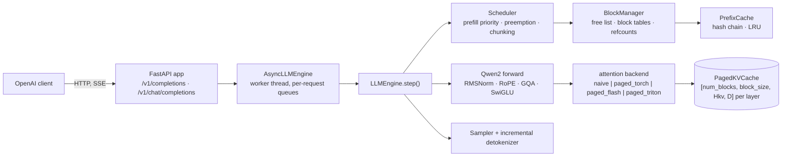
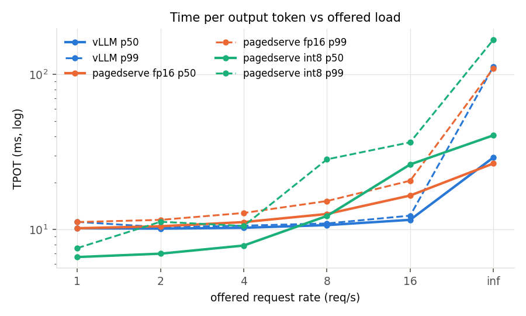
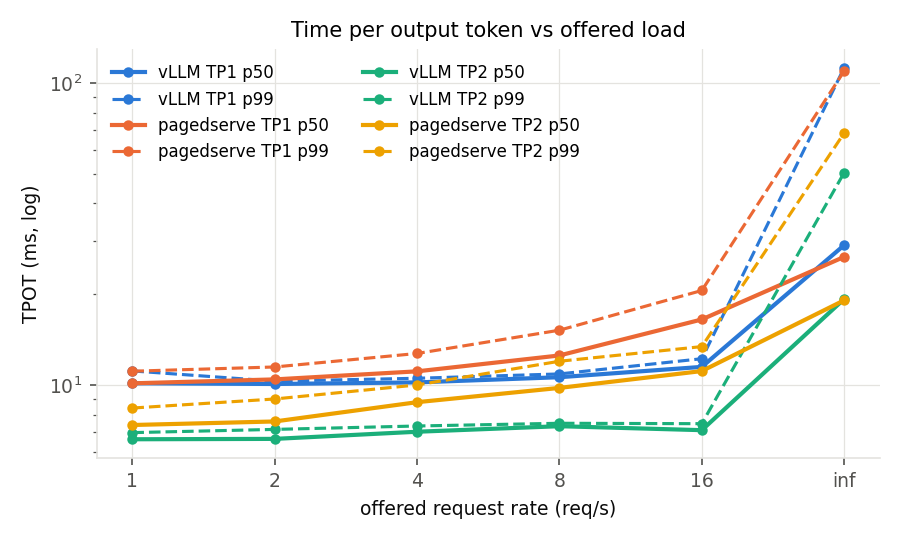

# How it works

Part of [emberserve](../README.md). The engine's design, component by component, and how its correctness is checked.



## The step loop

`LLMEngine.step()` is `schedule -> build inputs -> forward -> sample -> postprocess`. Each
step is either a **prefill batch** (new or re-admitted requests, packed with no padding,
bounded by `max_num_batched_tokens`) or a **decode batch** (one token for every running
request). Tokens are packed `[num_tokens, heads, head_dim]` with `cu_seqlens`, never padded.

## Scheduler

Prefill has priority: whenever the waiting queue is non-empty and the request's blocks can be
allocated, the step is a prefill; otherwise it is a decode over everything running. Admission
is block-gated FIFO, so a request never starts unless its prompt fits. When decode runs out of
blocks, the youngest running request is preempted by recompute (blocks freed,
`num_computed_tokens` reset, back to the front of the queue). Outputs are identical with or
without preemption; that is a test.

With `--enable-chunked-prefill` (Sarathi-Serve / vLLM style; the default on CUDA) a step
is instead **mixed**: one
decode token for every running request whose prefill is done, plus as many prompt tokens as
fit in the remaining `max_num_batched_tokens` (mid-prefill requests first, then new ones). A
long prompt is split across steps, so it no longer stalls every decoder's TPOT for one long
step, and prompts longer than the budget are accepted. A partial chunk writes K/V and emits
nothing; the token is sampled only on the step that completes the prompt
(`SchedulerOutput.prefill_complete`). Chunked outputs equal unchunked outputs; also a test.

With `--async-scheduling` (vLLM v1's trick; the default on CUDA) the engine launches step
N+1 before it has read step N's sampled tokens back from the GPU: the scheduler assumes every sampled request
advanced by one token, decode rows whose token is still on the device take it from the
previous step's sampled tensor with a device-side gather, and the tokens come back through
a pinned buffer whose copy was enqueued before step N+1's kernels, so waiting for them never
waits for step N+1. The CPU work of a step (schedule, pack inputs, launch, detokenize)
overlaps the GPU work of the previous one and the device never idles between steps. A
request ending on EOS computes one extra token that is discarded; length limits are
anticipated (`Scheduler._finishes_on_resolve`) so they waste nothing. Outputs of a step are
returned by the next `step()` call; tokens are identical to the synchronous engine's,
including under preemption, chunked prefill, prefix caching, seeded sampling and aborts.

## Speculative decoding

`--speculative-ngram 3 --num-speculative-tokens 5` turns on prompt-lookup speculation
(`spec.py`): for every greedy request the engine looks up the last three tokens earlier in
the sequence and guesses that what followed them then follows now (code, quoted text,
names, lists). The guesses ride in the request's next decode step as extra query rows
over the cached context, exactly like a chunked-prefill chunk; the model's own greedy
choice at every position is compared with the guess at that position, the longest
agreeing prefix is kept together with the model's token after it, and the rejected
positions' K/V slots are given back (`BlockManager.truncate`). The output is bit-identical
to plain greedy decoding: every accepted token was checked against the same logits it
would have been sampled from. A step that carries drafts routes through the mixed
attention path (piecewise graphs where they are on), a step without any keeps the full
decode graph. Sampled requests are never drafted, and the mode turns async scheduling off
(the proposer needs the last token on the host). `/metrics` reports `spec_drafted_total`
and `spec_accepted_total`; on the synthetic random-id trace the acceptance rate is ~0, which
is why the real-text traces exist. Measured on ShareGPT text it is a net loss at every
rate, at 0.5B and at 7B (see [Real text](results.md#real-text-sharegpt-conversations-results_textjson)):
3-gram lookup accepts 16% of its drafts on chat text, the verification step runs through
the mixed-step path (eager at 7B) and async is off, and those cost more than 0.19 extra
tokens per step return. The exact verification is the reusable part; what it needs is a
fixed-`k` draft step captured as a graph bucket, async kept on, and a better proposer.

## Paged KV cache

Each layer's cache is one tensor `[num_blocks, block_size, Hkv, D]` for K and one for V.
A sequence owns a **block table** (list of physical block ids); token position `p` lives at
slot `table[p // block_size] * block_size + p % block_size`. The `BlockManager` keeps the
free list, allocates a block when the previous one fills, refcounts blocks so prefixes can be
shared, and reports utilization (`slots in use / slots allocated`). Memory waste is bounded by
one partial block per sequence, which is why block size is an ablation knob and not a detail.

For Qwen2.5-0.5B in fp16 one token of K+V across 24 layers is `2 * 24 * 2 * 64 * 2 B = 12 KB`;
20 GB of cache holds ~1.6 M tokens.

## Prefix caching

Every full block is hashed by the chain `(parent_hash, token_ids_in_block)`. A new request
looks up its prompt's leading full blocks, skips those tokens in prefill (attention still sees
them: `context_lens` counts cached positions and the queries are the last `query_len` of the
context), and shares the physical blocks by refcount. Unreferenced cached blocks sit in an
LRU and are evicted when the free list runs dry. A fully cached prompt still computes at least
its last token so there is a logit to sample from.

## Attention backends

All four implement one contract (`attn/base.py`): given packed Q/K/V for this step, write K/V
into the cache at the step's slots, then attend causally where `context_lens[i]` is the KV
length *after* the write.

| backend | decode | prefill | block size | notes |
|---|---|---|---|---|
| `naive` | per-sequence `torch.cat` cache | same | n/a | what "no KV cache management" looks like |
| `paged_torch` | `index_select` blocks into a padded `[B, max_ctx, Hkv, D]`, masked softmax | same | any | the reference for every other backend's tests |
| `paged_flash` | `flash_attn_with_kvcache(block_table=...)` | `flash_attn_varlen_func` | multiple of 256 | upstream flash-attn hard-checks `page_block_size % 256` |
| `paged_triton` | hand-written Triton kernel, grid `(B, Hkv, splits)` | `flash_attn_varlen_func` on the step's packed k/v; chunk rows with cached context are gathered out of the paged cache into a packed buffer first, decode rows of the same step still run the Triton kernel | multiple of 16 | one program owns one sequence, one KV head and all its GQA query heads; online softmax; split-K past 1k keys; `tl.dot` on tensor cores |
| `mla_torch` / `mla_triton` | absorbed latent attention: fp32 reference / Triton kernel over the `[c \| k_pe]` rows | flash varlen in the non-absorbed form (per-head k/v materialized from the latent); chunk rows gather + varlen like `paged_triton` | multiple of 16 | DeepSeek-V2/V3 and Moonlight; see below |

`paged_triton` exists because flash-attn's block-256 constraint is not free: at block 256 a
64-token shared prefix never fills a block and gets zero cache hits, and KV utilization drops
to 76%. The Triton kernel makes block 16 usable on the GPU.

## Latent attention and MoE

DeepSeek-V2/V3 (and Moonshot's Moonlight, which uses that architecture) replace per-head K/V
with **multi-head latent attention**: each token is projected to a 512-dim compressed latent
`c` plus a 64-dim rope key `k_pe` shared by all heads, and per-head keys and values are
`W_UK[h] c` and `W_UV[h] c`, never stored. The cache row is `[c | k_pe]`, 576 values per
token per layer (`kv/cache.py: PagedLatentCache`): Moonlight caches 31 KB per token where
its GQA equivalent would need ~220 KB. emberserve runs the *absorbed* form
(`attn/mla_torch.py`): `W_UK` is folded into the query (`q_c = W_UK[h]^T q_nope`, a
512-dim query per head) so scores are dot products against the raw cache rows, and `W_UV`
is applied after the softmax. Attention becomes MQA over the latent, 16 query heads
against one 576-wide key row, which is exactly what the Triton decode kernel is shaped for
and what flash-attn cannot do (its head dim tops out at 256). DeepSeek's RoPE pairs
dimensions (2i, 2i+1) rather than (i, i+D/2); the model permutes q_pe/k_pe once so the
same rotate-half kernel applies.

The MLP after the first layer is a **mixture of experts** (`model/moe.py`): a router scores
64 experts with a sigmoid, adds a per-expert bias that steers *which* experts are chosen
but not their weights (DeepSeek-V3's aux-loss-free balancing), keeps the top-6, normalizes
those six sigmoid scores and scales them by 2.446, and adds 2 shared experts every token
uses. Experts are stored stacked (`[E, 2I, H]` and `[E, H, I]`). The reference forward
loops over the experts that received tokens (gather, one fused SwiGLU, `index_add_` back);
on CUDA the layer is four launches (`model/moe_triton.py`): a Triton **router** kernel
(sigmoid, bias, top-k, gather, normalize, scale), a Triton **alignment** kernel that sorts
the `N x k` (token, expert) assignments into 16-row blocks that each belong to one expert
without ever asking the host how many tokens an expert got (program per expert: count,
prefix-sum, rank, scatter), and a **grouped GEMM** kernel run twice (gate/up over all
experts at once, then down with the routing weight folded in) whose program `(block,
n-tile)` multiplies its block's rows by *its* expert's weight tile. The loop version was
correct and 15x too slow on Moonlight: a host sync (`bincount` sizing its output) plus ~6
launches per active expert per layer made a 63.6 ms batch-1 step against a ~4 ms
weight-read floor; the fused path is 9.2 ms and, because nothing in it depends on tensor
values on the host, it captures into CUDA graphs along with the Triton MLA decode kernel.
The routing is tested against a line-by-line transcription of HF's `modeling_deepseek_v3`,
the kernels against the loop, the attention against a non-absorbed HF-style reference, and
the real model matches HF greedy on Moonlight through both the torch and the Triton paths.

## CUDA graphs

`--enable-cuda-graphs` captures the decode forward once per batch bucket (1, 2, 4, ..., 256)
into static input buffers; a step replays the bucket at or above its batch size with padded
rows pointed at one reserved scratch block. Graphs are worth more than any kernel at this
model size: the kernels themselves take a couple of milliseconds across 24 layers and the rest was launch overhead,
so TPOT fell from 9.1 to 3.8 ms on the 4090.

Prefill and mixed (chunked-prefill) steps have variable shapes, so they ran eagerly, and at
0.5B that made chunked prefill cost 11% at saturation. `--piecewise-cuda-graphs`
(`attn/piecewise_graphs.py`, vLLM v1's approach) captures everything *except* attention:
each decoder layer is three pieces, `pre` (input norm + residual add, projections, RoPE),
`attend` (the kernel, eager on the real rows with the step's real metadata) and `post`
(output projection, post norm, MLP); `pre` and `post` are row-wise, so they replay from
per-layer graphs on rows padded up to a token bucket, and padded rows never reach the KV
cache. A mixed step is then two replays plus the attention launches per layer. On the A100
it turned chunked prefill at 0.5B from an 11% loss into a 4% gain (14,904 tok/s) and halved
TTFT at low load (9.4 ms vs 19.8 eager, vLLM 12.9). At 7B it costs 1%: the padded chunk is
real compute there. So it is the default for checkpoints under 4 GB, and chunked prefill is
the default on CUDA wherever the mixed step is not eager (everywhere but a small model
served without graphs).

## Weight-only int8

`--quantization int8` (`model/quant.py`) halves the bytes of every projection after the
checkpoint is loaded: each 2-D `nn.Linear` of the decoder and the `lm_head` is replaced,
one at a time, by an `Int8Linear` holding `round(W / s)` in int8 with one fp32 scale per
output row (`s[n] = max_k |W[n,k]| / 127`); the fp16 copy is freed before the next layer
is converted, so a 7B checkpoint peaks at its fp16 size and settles at ~8 GB. Activations
stay fp16/bf16 and the arithmetic does not change: a Triton GEMM streams the int8 weight
tiles, converts them to the activation dtype in registers, multiplies on the tensor cores
and applies the row scale to the fp32 accumulator (`(x @ q^T) * s`, an exact
rearrangement of `x @ (q * s)^T`), with the bias folded into the same epilogue. Tiles
are chosen from the row count (16x64 at decode, 128x128 for prefill). It is a quality
trade, not an exact transform, which is why it is a flag and not a default:
`scripts/check_golden.py --quantization int8` reports how many greedy tokens move against
the fp16 golden run. Embeddings, MLA's `kv_b_proj` (read directly by the attention kernel)
and the MoE expert stacks (3-D weights, their own grouped GEMM) stay in fp16/bf16. The
point at 7B is the batch-1 decode step, which is the weight read (15 GB at ~1.5 TB/s,
~10 ms); halving the read halves that floor, and at larger batches, where the step turns
compute-bound, the gain shrinks to nothing. Measured on the 7B (A100, `paged_flash` +
graphs; `results/profile_7b_fp16.json`, `profile_7b_int8_v2.json`,
`pagedserve_7b_flash_int8_v2.json`):

| decode step (ms) | batch 1 | batch 8 | batch 32 | batch 128 |
|---|---:|---:|---:|---:|
| fp16 (cuBLAS) | 10.09 | 10.31 | 10.81 | 15.13 |
| int8, first kernel | 7.78 | 8.59 | 19.43 | 29.18 |
| int8, v2 (autotuned tiles + split-K) | **6.37** | **6.88** | **9.57** | 19.81 |

| req/s offered | vLLM TPOT p50 | emberserve fp16 | emberserve int8 |
|---|---:|---:|---:|
| 1 | 10.2 ms | 10.2 ms | **6.6 ms** |
| 4 | 10.2 | 11.1 | **7.9** |
| 8 | 10.6 | 12.6 | 12.2 |
| 16 | 11.5¹ | 16.5¹ | 26.3 |
| all at t=0, tok/s | 3,188 | 3,166 | 2,548 |

¹ Sep 27; on Sep 29, same pod, vLLM 0.30.0: 16.05 vs 15.85 ms (see [The 7B tail, re-measured](results.md#the-7b-tail-re-measured)).

The first kernel halved the bytes and cut the batch-1 step 23%, not 50%: it launched
56–72 programs for the A100's 108 SMs (`N / BN` tiles of a one-row output) and read at
0.96 TB/s, and above batch 32 its one fixed tile shape plus a register transpose of the
weight tile left it 2x behind cuBLAS. v2 reads the weight tile in the layout `tl.dot`
wants, autotunes the tile shape per (M bucket, N, K) at load time, and cuts the K range
into pieces when the output has too few tiles (split-K: fp32 partials and a reduce kernel
carrying the scale and bias): 6.37 ms at batch 1 (−37%), ahead of fp16 to batch 32, and
still 31% behind cuBLAS at batch 128, which is the compute-bound end where a hand-written
Triton GEMM has to beat a tuned library. Over HTTP that is TPOT below vLLM's by a third
up to 4 req/s and a loss from 8 req/s up, where chunked-prefill steps run the same kernel
at M = 2048. Quality: the golden check reports 2 of 7 prompts exact for 64 tokens and the
other 5 diverging at a near-tie (top-2 margins 0.05–0.39 logits), the expected cost of
per-channel rounding. So `--quantization int8` is the right flag for a latency-bound
deployment at small batch, and the wrong one at saturation until the large-M path is
either a better kernel or a dequantize-then-cuBLAS step. `EMBERSERVE_INT8_KERNEL=0`
routes through the torch reference, `EMBERSERVE_INT8_AUTOTUNE=0` and
`EMBERSERVE_INT8_SPLITK=0` pin the kernel for A/B.



## Tensor parallelism

`--tensor-parallel-size 2` (`dist.py`) splits the dense model across two GPUs the Megatron
way: each decoder layer is cut along the dimension that needs no communication inside the
block, so a rank owns `num_heads / 2` query heads and `num_kv_heads / 2` KV heads (the
q/k/v rows of `qkv_proj` are column-parallel, `o_proj` row-parallel) and half of the MLP's
intermediate width (`gate_up_proj` column-parallel, `down_proj` row-parallel). The two
row-parallel projections each end in one all-reduce of `[num_tokens, hidden]`, and that is
the whole communication of a layer; embeddings and norms are replicated, the `lm_head` is
vocabulary-parallel with one all-gather of the logits at the end. The paged KV cache is
split the same way (a rank caches its own KV heads), so a 7B model that fills one A100
has 7.5 GB of weights and twice the KV blocks per GPU, and the batch-1 decode step, which
is the weight read, streams half the bytes.

The process model is vLLM's driver + workers: rank 0 is the engine (scheduler, block
manager, sampler; the API's engine-core process), the other ranks are
`python -m emberserve.dist` subprocesses running `LLMEngine.worker_loop` with no scheduler of
their own. Per step the driver broadcasts the step plan (the host-side lists
`_plan_inputs` computes: tokens, positions, slots, block tables) over a gloo group, every
rank materializes the same device tensors from it, and the driver's `input_ids` (which
under async scheduling hold tokens gathered on the device from the previous step's
logits, so no other rank could build them) go out over NCCL; then every rank runs the
identical forward and only the driver samples. The host-side broadcast never touches the
device, so async scheduling keeps its overlap, and the collectives are captured into the
CUDA graphs with the rest of the forward. Checkpoints are sliced as they are read
(`dist.shard_tensor`), one rank's slice per process, and a worker that loses its driver
exits on its own. Exactness: the two-process CPU tests (`tests/test_tensor_parallel.py`)
compare a TP=2 gloo engine token-for-token with the single-process engine through the
plain, async, chunked-prefill and speculative paths and through the engine-core
process; on the GPU (`tests/test_tp_gpu.py`) the tiny model through full-step graphs,
piecewise graphs + async and eager chunked prefill, and Qwen2.5-0.5B on two GPUs against
one. The 7B golden gate through TP=2 is ALL OK (6/7 prompts exact, one fp16 tie-break: the
row-parallel projections sum their halves in a different order). Latent attention and MoE
are single-GPU for now.

Measured on 2× A100 SXM (`results/pagedserve_7b_flash_tp2.json`, `results/vllm_7b_tp2.json`,
`results/profile_7b_tp2.json`), against the single-GPU rows from the same GPU type:

| Qwen2.5-7B fp16 | emberserve TP1 | emberserve TP2 | vLLM TP1 | vLLM TP2 |
|---|---|---|---|---|
| batch-1 decode step (`profile_step`) | 10.09 ms | **7.65 ms** | | |
| TPOT p50 @ 1 req/s | 10.2 ms | **7.4 ms** | 10.2 ms | 6.6 ms |
| TPOT p50 @ 16 req/s | 16.5 ms¹ | 11.2 ms | 11.5 ms¹ | 7.1 ms |
| TTFT p50 @ 1 req/s | 38.7 ms | 38.6 ms | 37.2 ms | 24.9 ms |
| throughput @ 16 req/s | 2,036 tok/s | 2,211 | 2,050 | 2,283 |
| saturation (200-request burst) | 3,166 tok/s | **4,485** (1.42×) | 3,188 | 4,949 (1.55×) |

¹ Sep 27. Re-measured on one pod on Sep 29 against vLLM 0.30.0: 15.85 vs 16.05 ms, mean
of four each ([The 7B tail, re-measured](results.md#the-7b-tail-re-measured)); the TP2 columns
were not re-run.



So the second GPU buys what the design says it should — the batch-1 step is the weight
read and it fell 24% (the ideal is 50%; the rest is communication), saturation rose 42% —
and vLLM gets more out of it: 91% of its TP2 throughput at saturation, parity to
16 req/s, and behind on latency at every rate (7.4 vs 6.6 ms at 1 req/s, 11.2 vs 7.1 at
16). The gap is the collective itself. A layer's two all-reduces are torch's NCCL ops,
and at `[1, 3584]` fp16 an NCCL all-reduce over NVLink is latency, ~25 µs, times 56 per
step ≈ 1.4 ms of the 7.65 ms; vLLM issues the same 56 through its custom NVLink
all-reduce kernel (one CUDA kernel reading the peer's buffer directly, well under 10 µs
each). With load the slope is steeper than vLLM's for the same reason multiplied: at 7B
the mixed prefill+decode step runs eagerly (piecewise graphs are off above 4 GB), so
each of its 56 all-reduces also pays a host-side launch, and `profile_step` shows the
TP2 step *slower* than TP1 at batch 128 (13.3 vs ~10.8 ms), which is where the
saturation ratio comes from. TTFT does not move under TP2 (38.6 vs 38.7 ms) while vLLM's
drops from 37 to 25: the prefill step is on the same eager path, and it is the next thing
to profile. The fix on the roadmap is the standard one, a custom all-reduce for small
messages (or fusing the all-reduce into the RMSNorm that follows it), plus piecewise
graphs for the TP mixed step so the collectives replay from the graph.

Three things the first two-GPU run taught, all in the shutdown path rather than the math
(the CPU tests had every collective right): NCCL will not destroy *or* abort a
communicator while a CUDA graph that captured its collectives still exists (the process
sat in `ncclCommDestroy` forever; `LLMEngine.release_graphs()` now runs on every rank
before the group goes, and the group is aborted rather than destroyed, which also
survives a peer that already exited); a driver that fails mid-step must kill its
workers instead of broadcasting "stop" to ranks blocked in a collective nothing pairs
with (otherwise the hang hides the exception); and the golden check's all-position
logits must travel through the step plan (`LLMEngine.step_logits`), because calling the
model directly on the driver while the worker ran the plan's last-row projection was an
all-gather of `[n, vocab/2]` against `[1, vocab/2]` — two NCCL kernels spinning at 100%
on both GPUs for as long as you let them.

## Correctness

```bash
make golden        # dump HF greedy + logits -> golden/, then check every CPU backend
python scripts/check_golden.py --device cuda --dtype float16 --backends paged_flash,paged_triton --block-size 256
```

fp32 runs must match the fp32 Hugging Face reference exactly: logits within 1e-3 and tokens
token-for-token, on all 7 prompts decoded together in one continuous batch (so batching,
paging and prefix sharing are all under test at once). Half-precision runs are compared to
the same fp32 reference, so the gate is self-calibrated: the logits bar is 1.0 and a token
flip counts as a numeric tie-break, not a failure, only when the top-2 logit gap at that
position is below 2x the logits error measured on prompt 0, i.e. the two candidates were
closer than the run's own precision noise. (Precisely: the weaker of the two disputed
tokens, the engine's and the reference's, must sit within 2x that error of the top logit;
checking only the top-2 gap would also excuse an unrelated wrong token.) Two gotchas this gate caught: Qwen2.5's
`generation_config.json` sets `repetition_penalty=1.05`, so `model.generate()` is not greedy
unless every knob is overridden; and `apply_chat_template` in transformers 5 returns an
encoding, not a string.

```bash
make test                          # 176 CPU tests, 2-layer random model, no download
python -m pytest -m gpu -n 4 -v    # 31 GPU tests: flash/triton kernels vs paged_torch, engine parity, graph capture
```
