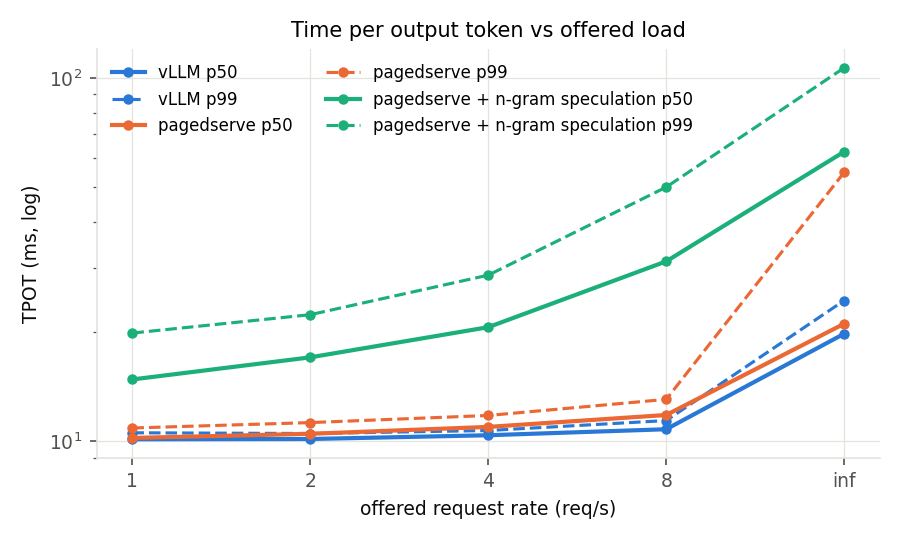

# Results in depth

Part of [emberserve](../README.md). Numbers come from the files in `results/` named in each section.

## Contents

* [RTX 4090 ablation](#rtx-4090-ablation-resultsablationjson-block-size-256-torch-280cu128)
* [A100 SXM 80 GB, decode-attention kernel](#a100-sxm-80-gb-decode-attention-kernel-resultskernels_a100_json)
* [A100 ablation](#a100-ablation-resultsablation_a100json-8-reqs-64-token-shared-prefix-before-the-five-fixes)
* [A correction: the sweeps replayed one trace, and vLLM cached it](#a-correction-the-sweeps-replayed-one-trace-and-vllm-cached-it)
* [A100, emberserve over HTTP vs vLLM](#a100-emberserve-over-http-vs-vllm-resultsvllmjson-resultspagedserve_json)
* [The gap against vLLM](#the-gap-against-vllm)
* [Moonlight: MLA + MoE on the A100](#moonlight-mla--moe-on-the-a100)
* [Real text: ShareGPT conversations](#real-text-sharegpt-conversations-results_textjson)
  * [Two API processes](#two-api-processes---api-workers)
* [The 7B tail, re-measured](#the-7b-tail-re-measured)
* [What the numbers taught us](#what-the-numbers-taught-us)
* [Appendix: the earlier front page](#appendix-the-earlier-front-page)

All 0.5B runs: Qwen2.5-0.5B-Instruct fp16, 200 requests, seed 0, `max_model_len 4096`. TTFT is
time to first token, TPOT is time per output token after the first, both per request.

## RTX 4090 ablation (`results/ablation*.json`, block size 256, torch 2.8.0+cu128)

**Open-loop, 8 req/s** (arrivals span 24.3 s; a config that keeps up finishes in ~25 s):

| config | tok/s | run | TTFT p50/p99 ms | TPOT p50/p99 ms | e2e p50 |
|---|---:|---:|---:|---:|---:|
| naive (per-seq `torch.cat`) | 343 | ~108 s | – | – | – |
| static batching | 595 | ~62 s | – | – | – |
| paged_torch | 700 | 52.8 s | 12.2 / 27.9 | 86.2 / 141 | 12.7 s |
| paged_flash | 1,329 | 27.8 s | 8.7 / 10.0 | 9.1 / 9.9 | 1.21 s |
| paged_flash + CUDA graphs | **1,441** | 25.6 s | 8.7 / 10.6 | **3.8 / 4.8** | 0.52 s |

These TTFT and e2e figures count from when the offline driver admitted a request, not from
when it arrived (fixed Sep 30, not re-measured): one that arrived mid-step waited up to one
step before its clock started, about half a TPOT on average (~4 ms for paged_flash, ~40 ms
for paged_torch). Throughput and run time are unaffected.

**Saturation, all 200 at t=0:** paged_torch 738 -> paged_flash 3,043 -> +graphs **5,459 tok/s**
(TTFT p50 279 ms, TPOT p50 12.4 ms).

**Prefix caching, 8 req/s:** a 64-token shared prefix did nothing at block 256 (no full block
is ever shared). A 512-token prefix moved TTFT p99 from 10.3 to 9.5 ms and nothing else,
because prefill on a 0.5B model is ~8 ms to begin with.

## A100 SXM 80 GB, decode-attention kernel (`results/kernels_a100_*.json`)

Decode attention only, H=14, Hkv=2, D=64, fp16, median of 20 calls. Ratio = Triton kernel
time / flash-attn time (1.0 = parity); the `tl.dot` tensor-core variant is the default.

| Triton block | ctx | B=1 | B=8 | B=32 | B=128 |
|---|---|---|---|---|---|
| 256 | 128 | 2.04x | 1.98x | 1.98x | 1.92x |
| 256 | 512 | 2.40x | 2.31x | 2.25x | 1.73x |
| 256 | 2048 | 2.26x | 2.25x | 1.93x | **1.16x** (835 vs 972 GB/s) |
| 16 | 2048 | 2.26x | 2.24x | 1.92x | 1.54x |

The first version of the kernel (broadcast-multiply, CUDA cores) was 3.3x–10.8x behind on the
same GPU and 4.2x behind on the 4090. Moving QK^T and PV onto tensor cores (`tl.dot`, query
heads padded 7 -> 16) closed the gap at large batch; what remains is a flat ~0.04 ms per call
that does not scale with work, so short contexts and small batches stay ~2x behind.
`paged_torch` on the same shape: 7.41 ms, 18 GB/s.

## A100 ablation (`results/ablation_a100.json`, 8 req/s, 64-token shared prefix, before the five fixes)

Every backend at its own minimum block size (`paged_flash` 256, the rest 16):

| config | block | tok/s | TTFT p50 | KV slot utilization |
|---|---:|---:|---:|---:|
| paged_torch | 16 | 584 | 28 ms | 99% |
| paged_flash | 256 | 1,054 | 20 | 79% |
| paged_flash + graphs | 256 | 1,407 | 20 | 76% |
| paged_triton | 16 | 918 | 28 | 98% |
| paged_triton + graphs | 16 | 1,394 | 28 | 98% |
| paged_triton + graphs + prefix | 16 | 1,394 | 28 | 98% |
| paged_flash + graphs + chunked | 256 | 1,406 | 27 | 76% |

The Triton path at block 16 keeps up with flash at block 256 (1,394 vs 1,407 tok/s) with
22 points more slot utilization; its +8 ms TTFT is the gather-path prefill fallback, not
the kernel. Chunked prefill changes nothing at 0.5B, where a prefill is ~8 ms; at 7B it is the difference between 24.8 and 17.5 ms TPOT (see [Models](models.md#models)).

## A correction: the sweeps replayed one trace, and vLLM cached it

Until Sep 29, `run_vllm_baseline` generated the trace from the same seed at every rate and
ran all the rates against one server. vLLM enables automatic prefix caching by default;
emberserve does not. So from the second rate on, vLLM was serving prompts it had already
seen: its prefix-cache hit rate on the Qwen3-8B sweep reached 48.4%, 58.9% and 64.3% as the
rates went by (`results/qwen3/vllm_qwen3_8b.json` has the same 53,404 prompt tokens at every
rate), and on a fresh server with a trace per rate it is 0.0%. emberserve's rows were never
affected; vLLM's rows after the first rate of every committed vLLM sweep were
(`results/vllm*.json`: 0.5B, 7B, TP2, R1-8B, Moonlight, and the ShareGPT text sweeps).

The harness now draws a different seed per rate by default (recorded as `trace_seed`;
`--same-trace-every-rate` restores the old behavior). Re-measured on one A100 SXM pod,
vLLM 0.30.0, fresh servers, each engine alternating with the other:

| Qwen2.5-7B, TPOT p50 | vLLM, old sweep | vLLM, fresh | emberserve, fresh | tok/s fresh, emberserve / vLLM |
|---|---:|---:|---:|---:|
| 2 req/s (mean of 2) | 10.1 ms | 10.32 ms | 10.41 ms | 341 / 341 |
| 4 req/s (mean of 2) | 10.2 | 10.86 | 11.15 | 728 / 728 |
| 8 req/s (mean of 2) | 10.6 | 11.98 | 12.35 | 1,274 / 1,276 |
| 16 req/s (mean of 4, [below](#the-7b-tail-re-measured)) | 11.5 | 16.05 | **15.85** | parity |
| all at t=0 (mean of 2) | 29.1 | 29.20 | **27.07** | **3,412 / 3,415 (100%)** |

| Qwen3-8B, mean of 3 fresh servers | emberserve | vLLM |
|---|---:|---:|
| 4 req/s: TPOT p50 / TTFT p50 | 12.71 / 47.7 ms | 11.98 / 44.0 ms |
| 16 req/s: TPOT p50 / TTFT p50 | **20.90** / 74.8 ms | 20.98 / 73.5 ms |
| 16 req/s, one run in the old-style sweep | 20.98 ms | *13.77 ms* (cache hits) |
| all at t=0: tok/s (runs) | 2,839 (2,909, 2,709, 2,899) | 2,972 (2,972, 2,958, 2,985) — emberserve 96% |
| all at t=0: TPOT p50 | 36.4 ms | 33.2 ms |

(`results/sweep_fresh/`, `results/qwen3/`.) At 7B the gap the old tables show between 2 and
16 req/s was the cache, not the engine. At 0.5B the effect is small — a 0.5B prefill is
cheap, and vLLM's TTFT on the old sweep is 12.9 ms at the first rate and 11.6–12.0 after —
so the 0.5B rate-sweep conclusions stand. The same replay happened between *repeats* on
one server (`--rates inf,inf,inf`): in `results/apiw/` vLLM's first synthetic-trace
saturation run is 17.3–17.6k tok/s and its later ones ~20.2k, with TTFT p50 falling from
279–296 ms to 152–218 ms, while emberserve's repeats move by 1–2%. So vLLM's cache-cold
synthetic saturation on that pod is ~17.5k, and two emberserve API workers (19.2k) are
~109% of it rather than the 95% of the cached runs reported there; on ShareGPT text vLLM's
repeats show no such step (24.8k, 25.4k, 24.8k), and the 112% stands. The tables below keep what was measured, with
this caveat on vLLM's columns; the Moonlight and R1-8B gaps are not yet re-measured and
overstate vLLM's lead by an unknown amount.

## A100, emberserve over HTTP vs vLLM (`results/vllm.json`, `results/pagedserve_*.json`)

Same load generator, same trace, same GPU, both servers fp16 with `max_model_len 4096`.
vLLM's rows after 1 req/s were partly served from its prefix cache
([correction](#a-correction-the-sweeps-replayed-one-trace-and-vllm-cached-it)); at 0.5B
that is worth ~1 ms of TTFT.
emberserve with its CUDA defaults: `paged_flash`, block 256, CUDA graphs (full-step for
decode, piecewise for prefill and mixed steps), chunked prefill, engine in its own process,
async scheduling, batched SSE writes (`results/pagedserve_flash_v9.json`; the saturation
row is the mean of three repeats). vLLM from its own venv, defaults.

| req/s offered | vLLM tok/s | emberserve tok/s | vLLM TTFT p50 | emberserve TTFT p50 ¹ | vLLM TPOT p50/p99 | emberserve TPOT p50/p99 |
|---:|---:|---:|---:|---:|---:|---:|
| 1 | 177 | 178 | 12.9 ms | **8.7** ms | 2.0 / 2.3 | **1.8** / 2.1 |
| 2 | 354 | 354 | 11.9 | **8.7** | 2.0 / 2.2 | **1.8** / 2.1 |
| 4 | 701 | 703 | 11.6 | **9.2** | 2.1 / 2.2 | **1.9** / 2.2 |
| 8 | 1,377 | 1,383 | 12.0 | **9.7** | 2.1 / 2.3 | **2.0** / 2.3 |
| 16 | 2,659 | 2,679 | 12.0 | **10.3** | 2.2 / 2.4 | **2.2** / 2.5 |
| all at t=0 | 16,269 | **16,635** | 421 | 228 | 8.1 / 12.8 | **5.7** / **13.0** |

¹ emberserve's TTFT column is the server-side mean (from the request's arrival at the API
process, `server_latency` in the JSON); the v9 sweep ran the load generator from four
processes, whose client-side TTFT is not comparable with vLLM's single-process column
(v8's client-side numbers on the same points were 9.4 / 10.0 / 11.0 / 11.5 / 12.4 ms).

Every version of the engine on the same sweep, one line per fix (the fix table is in the
[gap analysis](#the-gap-against-vllm)); v3, v5 and v6's low rates were not re-run on
their commits, so those lines start at 8 req/s; v9's saturation point is the mean of three
repeats. Figures:
`python -m emberserve.bench.plot --progression results/vllm.json results/pagedserve_flash*.json ...`
(`results/plots/progression/`).

(`results/pagedserve_flash_final.json` is the v8 run; regenerate the figures with
`python -m emberserve.bench.plot results/vllm.json results/pagedserve_flash.json results/pagedserve_flash_final.json --labels "vLLM,emberserve (first run),emberserve (after 8 fixes)" --ablation results/ablation_a100.json`.)

Rates 1–8 are latency comparisons (throughput equals offered load for both); 16 and the
saturation row compare capacity. The `paged_triton` server at block 16 matched these to
8 req/s but paid +8 ms TTFT and 1.7 s TTFT at saturation
(`results/pagedserve_triton.json`) because its fresh-prompt prefill went through the
gather path at the time; prefill now runs flash varlen at any block size.

## The gap against vLLM

`scripts/profile_step.py` times one decode step per phase at fixed batch sizes, with a
device sync inside `forward` so GPU time lands there (A100, `paged_flash` + graphs, ms per
step; `results/profile_flash_*.json`):

| batch | version | schedule | build_inputs | forward | sample | postprocess | total |
|---:|---|---:|---:|---:|---:|---:|---:|
| 1 | before | 0.01 | 0.15 | **3.93** | 0.08 | 0.03 | 4.22 |
| 1 | after fusion | 0.01 | 0.15 | **1.93** | 0.08 | 0.02 | 2.22 |
| 1 | final | 0.01 | 0.09 | 1.89 | 0.08 | 0.03 | **2.12** |
| 200 | before | 0.17 | 2.00 | 6.17 | **10.79** | 2.85 | 22.02 |
| 200 | batched sampler | 0.17 | 2.01 | 6.18 | 0.31 | 2.86 | 11.58 |
| 200 | after fusion | 0.17 | 1.97 | 3.82 | 0.31 | 2.11 | 8.44 |
| 200 | final | 0.17 | 0.54 | 3.78 | 0.31 | 1.22 | **6.07** |

The same night, in order, each fix chosen from the profile and re-measured over HTTP:

| commit | fix | saturation tok/s | TPOT p50 @16 req/s |
|---|---|---:|---:|
| `1e65f8b` | first measurement | 3,717 | 16.3 ms |
| `0987fda` | **one CUDA sync per sequence per step**: the sampler looped over rows and called `.item()` on each (10.8 of 22 ms at batch 200). Batched argmax and batched temperature / top-k / top-p with per-row parameters, one `.tolist()` per step | 4,739 | 12.9 |
| `404bcd2` | **per-token CPU work that scaled with output length**: the detokenizer re-decoded a request's entire output every step, and the SSE loop polled `request.is_disconnected()` per token per stream. Sliding-window incremental detokenization (vLLM/TGI's two-offset scheme); sse-starlette already cancels on disconnect | 6,417 | 9.6 |
| `d82393e` | **a 3.9 ms forward at batch 1 inside a CUDA graph**: graphs remove launch overhead, but every kernel still costs 3–4 us of GPU time and the model ran ~42 per layer (unfused RMSNorm is 8 on its own). Fused `qkv_proj` / `gate_up_proj` weights, decoder in (hidden, residual) form, Triton RMSNorm+residual, RoPE and SiLU-mul: ~13 kernels per layer | 8,356 | 4.2 |
| `3805000` | **per-step host->device traffic and per-request decode calls**: six small `torch.tensor(..., device=cuda)` copies plus a per-row block-table build became two pinned copies; two `tokenizer.decode` calls per request became two Rust `decode_batch` calls per step | 10,584 | 3.9 |
| `94bdca3` | **the server and the engine shared one GIL**: at 200 streams the in-process step was 6.1 ms but 10.2 ms seen through the server, because SSE delivery and the step loop serialized on the interpreter lock. The engine core now runs in its own process (`--engine-process`, default on CUDA): token ids cross a pipe, the API process keeps the tokenizer, batched detokenization and stop strings, and the two overlap | 13,945 | 3.1 |
| `02d44f5` | **the GPU idled while Python built the next step**: the remaining per-sequence CPU in the core (0.5 ms of input building and 1.2 ms of postprocessing at batch 200) sat on the critical path. Async scheduling (vLLM v1's trick, `--async-scheduling`, default on CUDA): step N+1 is scheduled, packed and launched before step N's tokens are read back; decode rows gather their token from the previous step's sampled tensor on the device; the read-back goes through a pinned buffer whose copy was enqueued before the next launch; length limits are anticipated so no token is wasted | 14,394 | 2.5 |
| `1942991` | **prefill and mixed steps ran eagerly**: the full-step graph needs fixed shapes, so chunked prefill (the scheduling that closed the 7B gap) *cost* 11% here (12,786 tok/s), ~20 Python launches per layer on every step that carried a prompt. Piecewise CUDA graphs (`--piecewise-cuda-graphs`, default on): every layer's projections, norms and MLP replay from per-layer graphs on token buckets, attention runs eagerly on the real rows between them, so a chunked step is two replays plus the attention launches per layer. Chunked prefill is now the default at every size, and the prefill step itself got cheaper: TTFT at 1 req/s 20 → 9 ms | 14,904 | 2.1 |
| `5335d1e` | **the engine waited for the API process**: a per-step log of the core showed a 2.5 ms step at 200 sequences and the core inside `step()` only ~65% of its active time, the rest blocked in the pipe to the API process, whose one event loop encoded and wrote one SSE event per token for 200 streams (and whose GC walked the heap every few thousand allocations: the p99 tail). Every wake-up of a request's route now sends everything queued for it in one write (`generate_batches`, raw `StreamingResponse`), the reader thread stopped copying the output list per token, and the collector is frozen after startup. Measured with a four-process load generator (the single-process one had capped both engines' client-side numbers) | **16,635** (mean of 3) | 2.2 |

What is left at 0.5B is not in the engine: at saturation both servers deliver ~23k tok/s
on real text and ~16.5k on the synthetic trace, and both are limited by their API process
(ours delivers 26–29k tok/s with a clock in place of the model, so it runs at ~80% of its
ceiling while the core still waits on the pipe a quarter of the time). Below saturation
emberserve is ahead on every metric. The batch-1 forward at 1.9 ms sits within ~2x of the
weight-read floor (~1 GB of fp16 weights plus the 272 MB `lm_head` per step on a 1.5 TB/s
part); at 7B the forward *is* the floor.

## Moonlight: MLA + MoE on the A100

Moonlight is the DeepSeek-V3 architecture (Kimi's lab's 16B / 3B-active model) and runs
through the from-scratch latent-attention + MoE path; it matches HF's greedy tokens through
both the torch and the Triton backends. Its decode step is a different animal from the
dense models': 27 layers of small routed GEMMs plus a 576-wide attention row, so the
per-step *launch count* and *parallelism* decide it, not the weight read. Per-kernel GPU
time from `scripts/profile_step.py --kernels` (`results/profile_moonlight_v2.json`):

| stage | commits | batch-1 step | what changed |
|---|---|---:|---|
| per-expert loop MoE | 5267e71 | 63.6 ms | one host sync (`bincount` sizing its output) + ~6 launches per active expert per layer |
| fused MoE: grouped GEMM over a block-aligned layout | 49a2b39, 6775437 | 9.4 ms | no host syncs, captures into CUDA graphs with the Triton MLA kernel |
| router + alignment as one Triton kernel each, rope permutation folded into weights, addmm epilogue, dual-pointer q | 480b029 … 467b53a | 7.2 ms | ~30 launches per MoE layer → 740 per step |
| split-K partition computed inside the kernel from the real context; q + kv_a in one GEMM | 738c291 | **6.2 ms** | MLA kernel 1.15 → 0.25 ms per step; 713 launches |

At 7.2 ms the step was 6.7 ms of kernels: grouped GEMM 1.9 ms (52 calls at 71% of HBM
bandwidth for the 6 touched experts, fine), the MLA decode kernel 1.15 ms (**43 µs per layer
for a 320-token context, which should be ~5**), cuBLAS gemv for q/kv_a/o_proj 0.8 ms, the
rest under 3% each. The MLA kernel's problem was the split-K partition: under CUDA graphs the
block table is padded to `max_model_len`, so a host-side split of the shape-derived context
gave split 0 every real tile and one program walked 20 tiles serially. The kernel now
partitions the real context length on the device (same fix applied to the dense Triton
kernel): 1.15 → 0.25 ms, and with q_proj + kv_a_proj_with_mqa as one GEMM the step is 6.2 ms.
What remains is the grouped GEMM (1.9 ms, at bandwidth) and the dense projections.

Over HTTP (`results/pagedserve_moonlight_v3.json`, chunked prefill + async scheduling):

| req/s offered | vLLM tok/s | emberserve tok/s | vLLM TPOT p50 | emberserve TPOT p50 | vLLM TTFT p50 | emberserve TTFT p50 |
|---:|---:|---:|---:|---:|---:|---:|
| 1 | 176 | 175 | 7.1 ms | 7.6 ms | 37 ms | 55 ms |
| 4 | 667 | 664 | 11.0 | 13.2 | 39 | 64 |
| 8 | 1,237 | 1,217 | 13.4 | 18.8 | 45 | 81 |
| 16 | 2,022 | 1,898 | 17.0 | 28.4 | 57 | 116 |
| all at t=0 | **3,223** | **2,697 (84%)** | 28.5 | 31.6 | 1,327 | 2,371 |

The first run, prefill-priority and synchronous, was 2,457 (76%) with 26.3 ms TPOT at
8 req/s: every arrival's prefill stalled every decoder, as at 7B. On ShareGPT text the same
configuration reaches 89% (below). The remaining gap grows
with concurrency (18.8 vs 13.4 ms at 8 req/s) and is the per-sequence slope of the step,
0.11 ms per sequence, most of it the grouped GEMM streaming more experts as the batch grows.

## Real text: ShareGPT conversations (`results/*_text.json`)

The sweeps above draw random token ids, which is fine for the engine (a token is a token)
but useless for anything that depends on the text: prefix caching, and speculation. So the
same 200-request sweep was repeated on ShareGPT conversations (`--sharegpt`, vLLM's own
filters: prompt 4–1,024 tokens, output ≤ 512, no prompt+output over 2,048). The trace comes
out shorter in prompt and longer in output than the synthetic one (mean 102 / 259 tokens vs
267 / 173), so it is more decode-heavy and both engines' saturation numbers rise.

**Qwen2.5-0.5B**, A100, fp16, `paged_flash` + the CUDA defaults (`results/vllm_text.json`,
`results/pagedserve_flash_text.json`, `results/pagedserve_flash_text_spec.json`):

| req/s offered | vLLM tok/s | emberserve tok/s | + n-gram spec | vLLM TPOT p50 | emberserve TPOT p50 | + spec TPOT p50 | vLLM TTFT p50 | emberserve TTFT p50 |
|---|---:|---:|---:|---:|---:|---:|---:|---:|
| 1 | 269 | 269 | 269 | 2.03 ms | **1.84 ms** | 2.14 ms | 13.2 ms | **11.1 ms** |
| 4 | 1,064 | 1,066 | 1,051 | 2.11 | **1.96** | 3.41 | 12.0 | **11.4** |
| 16 | 3,990 | 4,023 | 3,164 | 2.27 | **2.23** | 10.12 | 15.1 | **13.0** |
| all at t=0 | **22,908** | **18,763 (82%)** | 3,913 | 6.08 | **5.60** | 28.9 | 433 | 630 |

The shape is the synthetic result again: parity to 16 req/s with lower TPOT and TTFT at
every rate, a lower TPOT at saturation, and a saturation throughput gap. The saturation
point was then repeated eight times (`results/pagedserve_flash_text_sat_*.json`), with the
load generator in one process and in four: **18,716 ± 1,080 tok/s** (17,036–20,765)
against vLLM's 22,908–23,339 over three runs, i.e. **81% with a ±6% spread**, and the
client's process count makes no systematic difference. So at v8 the number to quote at
0.5B saturation was ~80%, not the 92% a single synthetic run had given, and the spread
was itself a finding: vLLM's runs land within 1% of each other while ours varied by 20%
end to end, with TPOT p99 doubling (10 → 24 ms) in the slow runs. That led to v9 (below).

The stall hunt (`EMBERSERVE_STEP_LOG`, `scripts/stall_report.py`, [GPU notes](gpu.md)) found two
things. Python's garbage collector is the tail: `gc.freeze()` after startup plus raised
thresholds (`EMBERSERVE_GC=tune`) took TPOT p99 from 9.7–18.1 to 9.4–11.1 ms over six
runs and was worth ~5% of throughput. The throughput itself is the API process: the
engine core's step is **2.5 ms at 100–200 running sequences** (a potential 60–80k tok/s)
but the core is inside `step()` only ~65% of its active time; the rest is blocked in the
pipe `send` to the API process (39% of its non-idle samples, `EMBERSERVE_SAMPLE_PROFILE`),
whose one Python event loop encoded and wrote one SSE event per token for 200 streams. At
0.5B the saturation number is a comparison of the two API servers, not the engines. v9
sends every output queued for a request in one write when the route wakes up
(`generate_batches`, a raw `StreamingResponse` instead of sse-starlette) and drops the
per-token list copies in the reader thread. Measured on the A100
(`results/pagedserve_flash_text_sat_v9*.json`, six runs, GC default and tuned):
**21,948–23,782 tok/s, mean 22,964, against vLLM's 22,908–23,339 (mean 23,111): 99%**,
up from 81%. Server-side mean TTFT 102–192 ms vs vLLM's 98–162; the GC tuning no longer
moves throughput but keeps TPOT p99 under 11.3 ms (9.3–14.9 without), so it is on by
default (`EMBERSERVE_GC=off`). With a clock instead of a model
(`scripts/bench_api_layer.py`) the pod's API process delivers 26–29k tok/s at 22–25 µs of
user CPU per token, so at 23k it is running at ~80% of its ceiling and the engine core
still waits on the pipe a quarter of the time; the next step there is a second API worker
or the per-token path inside the core's process, but at this point the two engines are
delivering the same tokens per second through the same kind of bottleneck.

### Two API processes (`--api-workers`)

So the next step was to split that process. `emberserve serve --api-workers N`
(`emberserve/server/multi.py`) runs one engine core and N API processes: a supervisor
binds one listening socket and every worker accepts on it, so whichever event loop is free
takes the next connection. The core keeps one pipe pair per worker and sends each only the
rows of the requests it added; a worker that dies has its requests aborted and the others
keep serving; `/metrics` on any worker sums every worker's counters through shared memory,
so the benchmark's server-side numbers stay right. (Not uvicorn's own `--workers`: each of
its workers would build the app, and with it an engine core of its own.)

With a clock instead of a model (`scripts/bench_api_layer.py --api-workers N`, 400k tok/s
offered, `results/apiw/api_layer.txt`), the pod's API layer scales almost linearly: 37.8k
tok/s with one worker, 75.0k with two (1.98×), 116k with four, at a flat ~25 µs of CPU per
token. With the model, 0.5B, A100 SXM, the same pod for both engines, three saturation
repeats each (`results/apiw/`), vLLM 0.30.0 with one and two API servers
(`--api-server-count`):

| 0.5B, 200 requests at t=0 | synthetic trace | ShareGPT text |
|---|---:|---:|
| emberserve, 1 API worker | 16,585 tok/s | 25,256 |
| emberserve, **2 API workers** | **19,153** (+15%) | **28,025** (+11%) |
| emberserve, 4 API workers | 18,696 | 28,025 |
| vLLM, 1 API server | 19,213 | 24,993 |
| vLLM, 2 API servers | 19,380 | 25,069 |

On real text two workers put emberserve at **112% of vLLM** (28.0k vs 25.1k tok/s, vLLM
given the same second API server), with client TPOT p50 3.8 ms against vLLM's 4.4–4.8. On
the synthetic trace they restore parity: 19.2k against vLLM's 19.2–19.4k, or 95% against
the ~20.2k of vLLM's runs after its first (each vLLM session's first synthetic run was
17.3–17.6k; the later ones replayed the same trace into vLLM's prefix cache, so against
the cache-cold runs it is ~109% —
[correction](#a-correction-the-sweeps-replayed-one-trace-and-vllm-cached-it)). This pod's vLLM is faster on that trace than the Sep 27 run (19.2k against
16.3k), which one API worker, at 16.6k as before, no longer matched. A second vLLM API
server changes nothing for vLLM, and four emberserve workers nothing over two: past two
workers the limit is the engine core and its pipe (the core's step is ~2.5 ms at 200
sequences, and it still pickles and sends every step's rows), which is the next place to
look. `--api-workers` defaults to 1.

The saturation TTFT column (630 vs 433 ms) turned out to be the load generator, not the
server. Both engines' `/metrics` now carry latency sums measured from the request's
arrival at the API process, and server-side the two engines' mean saturation TTFT is the
same within noise (emberserve 105–124 ms across the repeats, vLLM 98–162) while the
client-side p50 reads 240–630 vs 205–433: a single-process client sending 200 requests
and parsing 200 SSE streams queues for hundreds of milliseconds. The budget hypothesis was
wrong the other way: an 8,192-token prefill budget gives 243 ms server-side and 17.7k
tok/s, because bigger prefill steps hold every first token longer, so 2,048 stays.
`run_vllm_baseline --client-procs 4` runs the load generator from four processes
([GPU notes](gpu.md)).

**n-gram speculation at 0.5B loses at every rate** (third column): TPOT 2.14 vs 1.84 ms at
1 req/s and 10.1 vs 2.2 at 16, throughput a fifth of the baseline at saturation. The mode
turns async scheduling off (the proposer needs the last token on the host before the next
step is planned), which alone costs the 0.3 ms async had bought, and a draft step is a
multi-token step for that sequence that runs through the mixed-step path (piecewise graphs
plus eager attention over up to six rows per sequence) instead of the single decode graph;
at 0.5B the step is launches, so the verification step costs more than the decode steps it
replaces unless most drafts are accepted. The TTFT column of the spec run is lower (8.6 vs
11.1 ms at 1 req/s) for an unrelated reason: with async off, a step's outputs are returned
by that step instead of the next one.

**Qwen2.5-7B** on the same text (`results/vllm_7b_text.json`, `results/pagedserve_7b_text.json`,
`results/pagedserve_7b_text_spec.json`), the regime speculation is meant for:

| req/s offered | vLLM tok/s | emberserve tok/s | + n-gram spec | vLLM TPOT p50 | emberserve TPOT p50 | + spec TPOT p50 | vLLM TTFT p50 | emberserve TTFT p50 |
|---|---:|---:|---:|---:|---:|---:|---:|---:|
| 1 | 265 | 265 | 263 | 10.1 ms | 10.2 ms | 14.8 ms | 31 ms | 37 ms |
| 4 | 980 | 979 | 927 | 10.4 | 10.9 | 20.6 | 32 | 40 |
| 8 | 1,781 | 1,773 | 1,440 | 10.8 | 11.8 | 31.3 | 34 | 46 |
| all at t=0 | **5,927** | **5,298 (89%)** | 1,983 | 19.8 | 21.1 | 341 | 1,067 |

Parity to 8 req/s with TPOT within 1 ms of vLLM's and 89% at saturation (99% on the
synthetic trace: the text trace is decode-heavier, and the saturation gap is the burst's
prefill admission again, TTFT 1,067 vs 341 ms at t=0; see the budget A/B below). The
speculation run answers the question it was built for: the acceptance rate of 3-gram
prompt lookup on ShareGPT chat text is **16.2%** at every rate (`spec_acceptance`), and at
that rate the mode loses at 7B too, 14.8 vs 10.2 ms TPOT at 1 req/s. Two costs eat the
0.19 extra tokens a step yields: a draft step is a six-row mixed step, which at 7B runs
eagerly (piecewise graphs are off there: ~13 kernels × 28 layers of launch overhead on
top of the ~10 ms weight read), and async scheduling is off. The exact-verification
machinery is fine; the fix is a fixed-`k` draft step captured as a CUDA-graph bucket with
async kept on (verify on the device), and a proposer better than n-gram lookup for chat
text (a draft model reaches 60–80% acceptance where lookup gets 16%). Neither is done.

**Moonlight-16B-A3B** on the same text (`results/vllm_moonlight_text.json`,
`results/pagedserve_moonlight_text.json`; bf16, `mla_triton` block 16, CUDA defaults):

| req/s offered | vLLM tok/s | emberserve tok/s | vLLM TPOT p50 | emberserve TPOT p50 | vLLM TTFT p50 | emberserve TTFT p50 |
|---|---:|---:|---:|---:|---:|---:|
| 1 | 265 | 265 | 9.4 ms | 10.4 ms | 38 ms | 60 ms |
| 4 | 961 | 950 | 17.7 | 20.8 | 56 | 77 |
| 16 | 2,415 | 2,327 | 23.9 | 29.4 | 71 | 117 |
| all at t=0 | **3,943** | **3,505 (89%)** | 26.2 | 29.6 | 721 | 1,231 |

89% at saturation against 84% on the synthetic trace, for the same reason the 0.5B gap
moved the other way: shorter prompts mean less prefill, and Moonlight's prefill is where
emberserve is furthest behind (TTFT 60 vs 38 ms at 1 req/s: the non-absorbed MLA prefill
plus the grouped GEMM at prompt-sized M). The decode-side gap is the per-sequence slope
already described (29.4 vs 23.9 ms at 16 req/s).

## The 7B tail, re-measured

The Sep 27 comparison left one open item: TPOT p50 16.5 ms against vLLM's 11.5 at
16 req/s. Before touching the engine, a per-step trace went in (`EMBERSERVE_STEP_TRACE`,
`scripts/step_trace_report.py`: every step's kind, batch shape, host phases, CUDA-event GPU
time and the GPU idle gap before it) and the question was re-asked on one A100 SXM pod on
Sep 29, with vLLM 0.30.0 installed the same way, alternating the two engines
(`results/tail/`):

| Qwen2.5-7B, 16 req/s, same pod | TPOT p50 | TTFT p50 | inter-chunk gap p50 / p90 / p99 (3 runs) | server TPOT mean |
|---|---:|---:|---:|---:|
| vLLM 0.30.0 (4 runs) | 16.05 ms (16.04–16.06) | 67.7 ms (66.4–68.7) | 11.9 / 26.6 / 48.9 ms | 15.35 ms |
| emberserve (4 runs) | **15.85 ms** (15.83–15.88) | **59.3 ms** (58.5–60.0) | 12.1 / 20.7 / 49.5 ms | 15.40 ms |

The gap does not reproduce: at 16 req/s the two engines are at parity on TPOT (vLLM's
server-side mean is 0.05 ms lower, the client-side p50 0.2 ms higher) and emberserve's
TTFT is 8 ms lower. The Sep 27 vLLM numbers (11.5 ms TPOT, 35 ms TTFT) came from the
fifth rate of a sweep that had replayed the same 200 prompts four times into vLLM's prefix
cache; these runs start a fresh server for the one rate
([correction](#a-correction-the-sweeps-replayed-one-trace-and-vllm-cached-it)). This
section first blamed a different pod and an unrecorded vLLM version; that was wrong, but
`results/tail/vllm_version.txt` now records the version anyway. The inter-chunk gaps (new in the load generator: the time between
consecutive streamed chunks, i.e. each engine's step time as a client sees it) say why
both land at ~16 ms: a decode step of the 7B is 12 ms, and a step that also carries a
new prompt is 20–50 ms, in vLLM as in emberserve.

What the trace showed about emberserve's own steps (`results/tail/report.txt`), at
16 req/s:

* **The GPU is never waiting for the host.** The idle gap before a step is 0.03 ms at the
  mean and the p90, for decode and mixed steps alike: async scheduling keeps it fed.
* **Mixed steps did synchronize the stream, and it cost TTFT, not TPOT.** Building the
  mixed step's attention index tensors with `torch.tensor(list, device="cuda")` is a
  copy plus a stream sync (`EMBERSERVE_SYNC_DEBUG=1` found exactly three per mixed step,
  none per decode step). Pinned, non-blocking copies (`emberserve/devutil.py`) remove
  them; the one run of the old path (`EMBERSERVE_LEGACY_SYNC_COPIES=1`) measured TTFT p50
  67.8 ms and TPOT 16.06 against 58.5–60.0 and 15.83–15.88 over four runs with the fix.
* **The time is GPU work in the mixed steps.** 14% of steps carry a prompt; they average
  39 decode rows plus a 301-token chunk and 28.1 ms of GPU time, against 11.1 ms for a
  decode-only step. Per kernel (`scripts/profile_mixed_step.py`, 39 rows + 300 tokens):
  of the 15.5 ms a mixed step adds, 12.8 ms is the linear layers at 196 TFLOP/s (63% of
  the A100's fp16 peak; one cuBLAS tile shape, 256×128, is 18.9 ms of the step, and 339
  rows fill its second 256-row tile a third of the way), 1.4 ms is attention (the prompt
  rows go through flash-attn's split-KV kernel, padded, beside a second call for the
  decode rows), and ~2.3 ms is unfused elementwise work (SiLU, RMSNorm, index copies).

So the item closes as parity, not a fix. What is left is shared by both engines and is
where a 7B step could beat vLLM's: GEMM tile quantization at odd row counts (the chunk
size decides it), one paged varlen attention call per layer instead of two
(`scripts/bench_mixed_attn.py`: 173 vs ≤393 µs per layer at 32 rows + 270 tokens, host
launch time 139 vs 393 µs), and fusing the elementwise ops of an eager mixed step.

## What the numbers taught us

* **Launch overhead dominates a 0.5B model, then kernel count does.** The 4090 decode step
  is ~3.6 ms wall with graphs and ~9 ms without; the attention kernel itself is ~0.1 ms.
  Kernel choice moved throughput 2x (paged_torch -> paged_flash); removing launches moved
  TPOT 2.4x; and the A100 profile shows the graph still replays ~1,000 tiny kernels per
  step. Nothing about this model is compute-bound at these batch sizes.
* **Measure the step, not the kernel.** Four of the five fixes that took saturation from
  3.7k to 10.6k tok/s were Python (syncs, O(n) detokenization, host->device traffic,
  per-request decode calls), found only by timing phases with a device sync in the right
  place. The kernel micro-benchmark could not have shown any of them.
* **Block size is a memory-vs-kernel trade.** Block 16 gives 98% slot utilization and makes
  short shared prefixes cacheable; flash-attn demands 256 and gives 76%. On an 80 GB card with
  a 0.5B model the waste never bites (nothing was ever preempted), which is exactly why the
  ablation has to say so rather than assume paging "saves memory" here.
* **Prefix caching needs prefixes.** With ShareGPT-like traces and no system prompt it is a
  no-op; with a 512-token shared prefix it saves ~1 ms of an ~9 ms TTFT. It pays on long
  shared system prompts, which this trace does not have.
* **A benchmark harness has state too.** Replaying one seeded trace at every rate on one
  server is fine for an engine without a prefix cache and quietly wrong for one with it:
  vLLM's hit rate reached 64% by the last rate, and a 7B "gap" at 16 req/s (16.5 vs
  11.5 ms) that became the first work item was mostly that. Fresh servers and a trace per rate
  now; the cache hit rate belongs next to every number that could depend on it.
* **Chunked prefill needs expensive prefills, not long prompts.** At 0.5B a prefill is
  ~8 ms and chunking changes nothing on a 208-token-median trace; at 7B the same prompt is
  ~30 ms of compute and prefill-priority scheduling was the whole gap to vLLM at 16 req/s.
  The knob that matters is prefill cost relative to a decode step, which grows with model
  size.

## Appendix: the earlier front page

The README's first page before the restructure, kept for the record. Its vLLM numbers
predate the [benchmark correction](#a-correction-the-sweeps-replayed-one-trace-and-vllm-cached-it).

Qwen2.5-0.5B-Instruct fp16, 200-request ShareGPT-like trace (prompt median 208 tokens,
output median 131), seed 0, same trace for every row. Raw files in `results/`.

| | RTX 4090 | A100 SXM 80 GB |
|---|---:|---:|
| naive per-sequence cache, 8 req/s | 343 tok/s | |
| paged_flash + CUDA graphs, 8 req/s | 1,441 tok/s, TPOT p50 3.8 ms | 1,381 tok/s, TPOT p50 2.0 ms (HTTP) |
| paged_flash + CUDA graphs, all 200 at t=0 | 5,459 tok/s (in-process) | **16,635 tok/s** (HTTP, mean of 3; engine process, async scheduling, chunked prefill on piecewise graphs, batched SSE writes) |
| vLLM, same trace, same GPU, 8 req/s | | 1,377 tok/s, TPOT p50 2.1 ms |
| vLLM, all 200 at t=0 | | 16,269 tok/s (one run, after five rates of the same trace; see the correction below) |
| Triton decode kernel vs flash-attn, B=128 / ctx 2048 | 4.2x slower (first version) | **1.16x** slower (835 vs 972 GB/s) |
| KV-cache slot utilization, block 16 vs 256 | | **98% vs 76%** |

Against vLLM on the A100 with Qwen2.5-0.5B: throughput parity to 16 req/s (100%), lower
latency than vLLM at every offered rate (TPOT 1.8 vs 2.0 ms and TTFT 9.4 vs 12.9 ms at
1 req/s; TPOT 5.7 vs 8.1 ms at saturation), and parity at saturation too: 16,635 vs
16,269 tok/s on the synthetic trace (mean of three) and 22,964 vs 23,111 on real text
(mean of six, see [Real text](#real-text-sharegpt-conversations-results_textjson)), up
from 23% at the first measurement. Nine profile-driven fixes; the last one was not in the
engine at all but in the API process that streams the tokens. At 7B (Qwen2.5-7B-Instruct) both engines sit on the
weight-read floor and emberserve reaches 99% of vLLM at saturation with chunked prefill and
async scheduling; DeepSeek-R1-Distill-Llama-8B (llama path) is also at 99%, and Moonlight-16B-A3B (DeepSeek-V3's
latent attention + MoE) reaches 84% on the synthetic trace and 89% on real text with a
batch-1 step of 6.2 ms against vLLM's 7.1 ms TPOT. The [gap analysis](#the-gap-against-vllm) has the per-phase profile and the nine
fixes it drove, in order; [Models](models.md#models) has the per-model table. With two API
processes (`serve --api-workers 2`) the 0.5B reaches 28.0k tok/s on real text against
vLLM 0.30.0's 25.1k on the same pod, 112% ([Two API processes](#two-api-processes---api-workers)).
And it starts fast: Qwen3-8B goes from process start to first token in **6.7 s against
vLLM's 69.1 s** (55.2 s with `--enforce-eager`) on the same A100, the 7B in 5.6 s
([Cold start](cold-start.md#cold-start-process-start-to-first-token-resultscoldstart)); on Runpod
Serverless a cold Qwen3-8B job is picked up in **17.2 s against worker-vllm's 147.5 s**
with the weights baked in, and with a small image that streams them from Hugging Face into
the engine as they download, **91.7 s against 210.4 s on a fresh host** (`delayTime`,
RTX 4090), every second split into Runpod's and the engine's phases ([On Runpod Serverless](cold-start.md#on-runpod-serverless-emberserve-vs-worker-vllm-resultsserverless_coldstart_qwen3)).

**A correction (Sep 29).** The sweep harness replayed the identical trace at every rate on
one server, and vLLM runs with prefix caching on by default (emberserve's is off), so vLLM
served every rate after the first partly from cache — its log shows a 48–64% prefix-cache
hit rate on such a sweep. Re-measured with a trace per rate and fresh servers, the 7B is at
parity from 2 to 16 req/s and at saturation (3,412 vs 3,415 tok/s), and Qwen3-8B is at
parity at 16 req/s and 96% at saturation. The rows that are not yet re-measured are
marked; see [the correction](#a-correction-the-sweeps-replayed-one-trace-and-vllm-cached-it).
